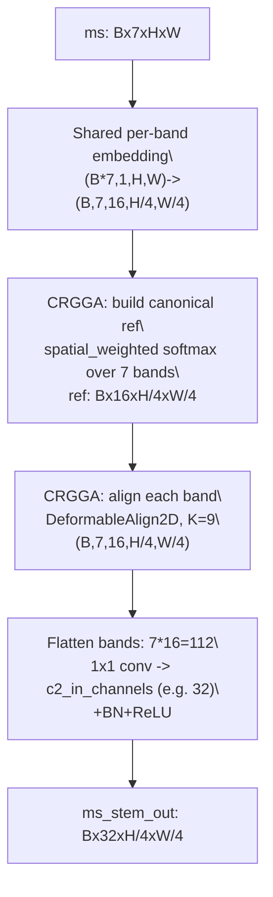
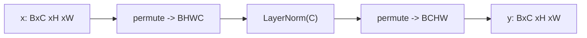
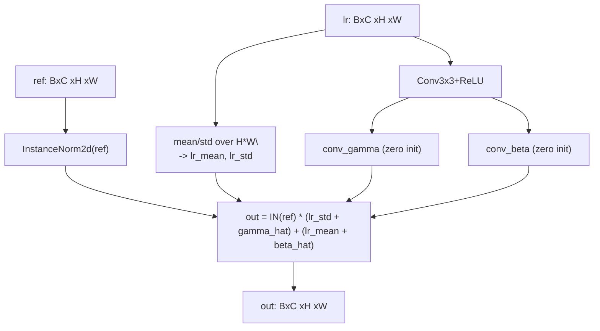
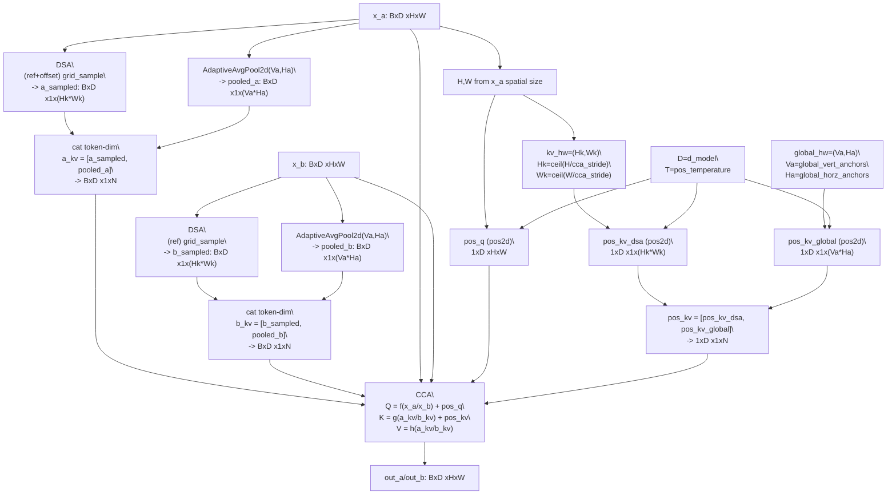
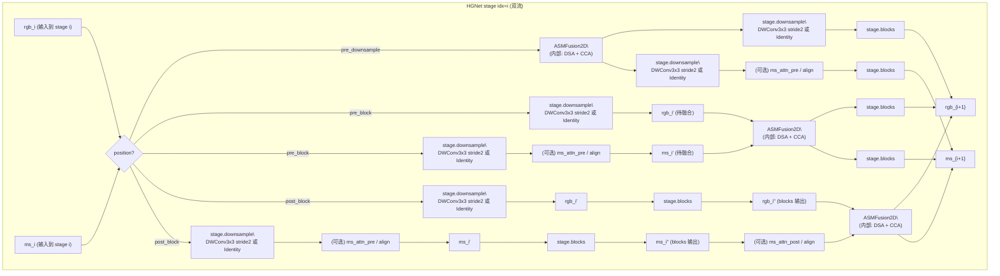
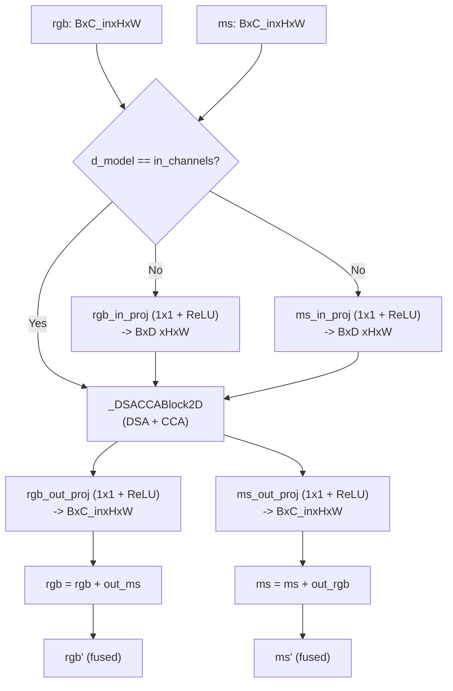
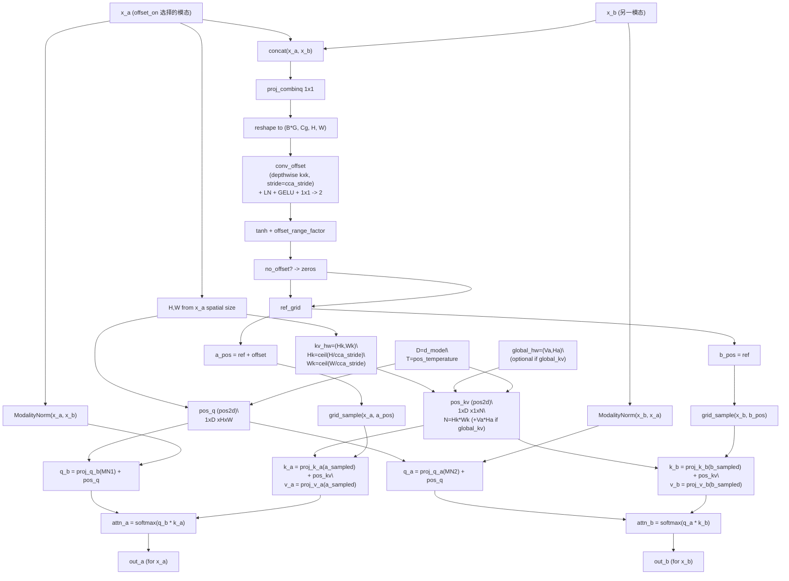
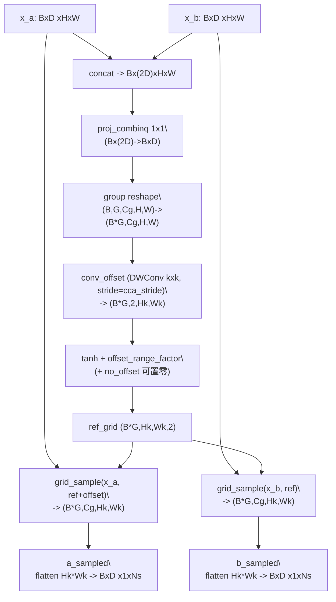
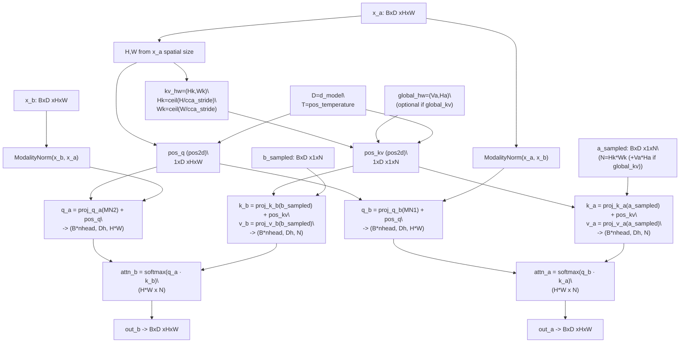

# ASMFusion2D（Adaptive Sampling Multispectral Fusion）模块设计说明（中文）

本文梳理 `adaptive_sampling_ms_fusion.py` 的实现细节，说明它如何完成同尺度 RGB/MS 特征的对齐与融合，并给出完整流程图。

历史命名提示：该模块早期常被称为 “C2FormerFusion2D / DSACCAFusion2D”（代码中仍保留兼容 alias）。

本文默认以该配置为“基准实验”来解释行为（开启 global_kv + 2D 位置编码）：

`configs/task/rtmsfdetr/oil_rgb_msi_20260115_3cls/rtmsfdetr_oil_rgb_msi_20260115_det_rtv4_hgnetv2_m_distill_dualstream_c2former_postblock_add_wbadd_c3c4c5_msbandsep_c2align_infonce_reg_globalkv_pos2d.yaml`

## 1) 文件位置与模块定位

- 实现文件：`engines/models/rtmsfdetr/rtdetrv4/engine/backbone/adaptive_sampling_ms_fusion.py`
- 模块职责：对**同尺度**的双流特征（RGB/MS）做“可变形对齐 + 跨模态注意力融合”，输出两路增强后的特征。
- 逻辑拆分（命名规避论文缩写，便于工程复用）：
  - **DSA（Deformable Sampling Aligner）**：通过 offset 预测 + `grid_sample` 实现粗对齐采样（论文中的 AFS 思路）。
  - **CCA（Complementary Cross Attention）**：跨模态互补式交叉注意力融合（论文中的 ICA 思路）。

## 2) 在模型中的位置（进入 C2Former 前的 Conv 是什么？）

在本项目里，C2Former 融合发生在 `HGNetv2DualStream` 的 stage 循环中，并且**支持通过配置切换插入位置**：

- `model.backbone_fusion.position: pre_downsample`  
  `C2Former -> stage.downsample -> (可选对齐/注意力) -> stage.blocks`
- `model.backbone_fusion.position: pre_block`（常用）  
  `stage.downsample -> (可选对齐/注意力) -> C2Former -> stage.blocks`
- `model.backbone_fusion.position: post_block`（更接近论文/原始实现的 stage_end 融合）  
  `stage.downsample -> (可选对齐/注意力) -> stage.blocks -> (可选对齐/注意力) -> C2Former`

> 本文“基准实验”使用 `position: post_block`，即在每个 stage 的 blocks 之后做融合。

三种方式的共同点：融合后都会写回到两路特征，并且若该 stage 属于 `return_idx`，则输出到 FPN 的特征是**融合之后**的特征（再按配置做 `add/wavg/concat1x1` 等输出合并）。

> 重要工程细节：当 `position=post_block` 时，C2Former 的 `in_channels` 会随 stage 变化为该 stage 的 **out_channels**（因为融合发生在 `stage.blocks` 之后）；当 `position=pre_downsample/pre_block` 时，`in_channels` 为该 stage 的 **in_channels**。

也就是说：你看到“进入 c2former 前的卷积”，通常指的是 **HGNetv2 stage 自带的 downsample conv**，它是 backbone 结构的一部分，不属于 C2Former 本身。

### 2.1 HGNetv2 的 stage downsample conv 做的是什么？

- 实现：`HG_Stage.downsample` 是一个 **depthwise 3x3 conv，stride=2**（`groups=in_chs`），用于把特征图分辨率减半；某些 stage（如 stage1）可能是 `Identity`。  
- 作用：构建多尺度特征金字塔、降低后续 blocks 与融合模块的总体计算量，并确保 RGB/MS 在同尺度上进行融合。

因此，这个 conv 的“降采样”是**空间分辨率的降采样（H/W 变小）**。

### 2.2 C2Former 是否可以“把这个 conv 也包含进去”？

从工程结构上，`stage.downsample` 属于 HGNetv2，不建议挪进 C2Former（会影响 backbone 结构与配置）。  
但从“功能流程图”的视角，可以把它视为“进入 C2Former 之前的必经预处理”，在文档里会把它画在 C2Former 之前，帮助理解尺度变化。

### 2.3 该实验配置里的 `backbone_ms_band_sep`（MSBandSeparatedStemAlign）在做什么？

以这个配置为例：

`configs/task/rtmsfdetr/oil_rgb_msi_20260115_3cls/rtmsfdetr_oil_rgb_msi_20260115_det_rtv4_hgnetv2_m_distill_dualstream_c2former_postblock_add_wbadd_c3c4c5_msbandsep_c2align_infonce_reg_globalkv_pos2d.yaml`

其中 `model.backbone_ms_band_sep`（YAML 第 30 行起）会让 **MS 分支的 stem** 走一条“按 band 独立提特征 + 在 C2 尺度做 7-band 对齐 + 再融合成 HGNetv2 需要的 C2 通道”的路径，从而做到：

- **在任何跨 band 混合（cross-band mixing）之前**完成对齐；
- 对齐发生在 **C2 尺度**（约 `H/4, W/4`），与 HGNetv2 原始 stem 输出尺度一致；
- 对齐模块是 **CRGGA（GroupwiseDeformableAlign2D）**，但输入里 band 维度是显式的 `(B,N,C,H,W)`，因此属于“真·按 band 对齐”，不是后续 stage 的投影式 group 对齐。

对应实现文件：

- MS band-separated stem：`engines/models/rtmsfdetr/rtdetrv4/engine/backbone/ms_band_sep.py:56`
- 7-band 对齐模块 CRGGA：`engines/models/rtmsfdetr/rtdetrv4/engine/backbone/group_deform_align.py:23`

#### 2.3.0 配置片段（原样摘录）

```yaml
backbone_ms_band_sep:
  enabled: true
  embed_channels: 16
  embed_use_bn: true
  align:
    enabled: true
    ref_mode: spatial_weighted
    ref_detach: true
    num_iters: 1
    num_keypoints: 9
    offset_enabled: true
    offset_scale: 3.0
    attention_norm: softmax
    padding_mode: border
    align_corners: true
    loss_type: infonce
    loss_downsample: 0.5
    nce_patch_size: 5
    nce_num_patches: 64
    nce_tau: 0.2
    loss_weight: 0.02
    loss_offset_weight: 0.01
    loss_attn_entropy_weight: 0.001
```

#### 2.3.1 字段含义（对照实现）

- `enabled`: 是否启用该 MS stem 替换；启用后 MS 分支不再调用原始 `ms_backbone.stem`，而是调用 `MSBandSeparatedStemAlign`（`engines/models/rtmsfdetr/rtdetrv4/engine/backbone/hgnetv2_dualstream.py:1415`）
- `embed_channels`: 每个 band 的 embedding 通道数（上例为 16）；对齐发生在这个 embedding 空间
- `embed_use_bn`: embedding 小 CNN 是否使用 BN（一般更稳定）

`align.*`（CRGGA 对齐器）：

- `ref_mode`: canonical reference 的构建方式（`mean/global_weighted/spatial_weighted`；上例为 `spatial_weighted`）
- `ref_detach`: offset 预测时对 reference 断梯度（更稳，避免 ref 与 warp 互相追逐）
- `num_iters`: 对齐迭代次数（上例 1 次；>1 会重复“构 ref -> 对齐所有 band”）
- `num_keypoints`: deformable 对齐的 keypoints 数 K（上例 9）
- `offset_enabled`: 是否启用 offset（若关闭则 offset=0 且 attention 为均匀分布，等价于不对齐）
- `offset_scale`: offset 幅度尺度（越大允许形变越大）
- `attention_norm`: keypoint attention 的归一化方式（`softmax/sigmoid`）
- `padding_mode/align_corners`: `grid_sample` 的边界与坐标设置
- `loss_type`: 对齐相似度损失类型（`cosine/infonce`）
- `loss_downsample`: 仅用于 **loss 计算** 的下采样比例（不影响前向输出分辨率）
- `nce_patch_size/nce_num_patches/nce_tau`: `infonce` 的 patch 平滑窗口、采样点数与温度系数
- `loss_weight/loss_offset_weight/loss_attn_entropy_weight`: 对应 `loss_ms_group_align / loss_ms_group_offset / loss_ms_group_attn_entropy` 的系数（已经在 CRGGA 内部乘过）

#### 2.3.2 前向流程（带形状/通道变化）

该模块在 `HGNetv2DualStream.forward` 中替代 `ms_backbone.stem`（见 `engines/models/rtmsfdetr/rtdetrv4/engine/backbone/hgnetv2_dualstream.py:1415`），流程如下：

1) **输入**  
`ms`：`B x 7 x H x W`（7 个 band 作为通道输入）。

2) **Per-band embedding（不做跨 band 混合）**  
配置：`embed_channels: 16`, `embed_use_bn: true`。  
实现：先 reshape `(B,7,H,W)->(B*7,1,H,W)`，对每个 band 使用同一套轻量 CNN（两层 `Conv3x3 stride=2`），输出：

- `z`：`B x 7 x 16 x (H/4) x (W/4)`  
对应 `engines/models/rtmsfdetr/rtdetrv4/engine/backbone/ms_band_sep.py:14`。

3) **C2 对齐（CRGGA，对齐发生在 band 维度）**  
配置块：`backbone_ms_band_sep.align`。  
核心思想：先从所有 band 构建一个“canonical reference”，再把每个 band deform 到该 reference。

- `ref_mode: spatial_weighted`：每个空间位置为 7 个 band 预测 softmax 权重，生成参考特征 `ref`（`B x 16 x H/4 x W/4`）。  
对应 `engines/models/rtmsfdetr/rtdetrv4/engine/backbone/group_deform_align.py:156`。
- 对每个 band `i`（循环 `i in [0..6]`），用 `DeformableAlign2D` 预测 `num_keypoints=9` 的 offset+attention，并 `grid_sample` 得到对齐后的 `aligned_i`（形状仍为 `B x 16 x H/4 x W/4`）。  
对应 `engines/models/rtmsfdetr/rtdetrv4/engine/backbone/group_deform_align.py:219`。
- `ref_detach: true`：offset 网络看到的 reference 不回传梯度，避免 reference 与 warp 互相“追逐”导致不稳定（见 `engines/models/rtmsfdetr/rtdetrv4/engine/backbone/group_deform_align.py:206`）。

对齐输出仍为：`B x 7 x 16 x (H/4) x (W/4)`。

4) **Merge 回 HGNetv2 的 C2 输入通道**  
把 band 维展平：`(B,7,16,H/4,W/4) -> (B,112,H/4,W/4)`，再用 `1x1 conv + BN + ReLU` 映射成 HGNetv2 stage1 所需的 `c2_in_channels`（B2 为 32，由代码自动取 `stage_in_channels[0]`）。  
对应 `engines/models/rtmsfdetr/rtdetrv4/engine/backbone/ms_band_sep.py:130` 和 `engines/models/rtmsfdetr/rtdetrv4/engine/backbone/hgnetv2_dualstream.py:542`。

最终 `ms` stem 输出变为：`B x 32 x (H/4) x (W/4)`，后续就进入 HGNetv2 的 stage 循环（与 RGB 分支同步）。

#### 2.3.3 对齐损失（infonce + 正则）是怎么接进总 loss 的？

当 `backbone_ms_band_sep.align.enabled=true` 且在训练态：

- `MSBandSeparatedStemAlign` 会返回 `(ms_out, aux_losses)`（见 `engines/models/rtmsfdetr/rtdetrv4/engine/backbone/ms_band_sep.py:137`）
- `HGNetv2DualStream.forward` 会把 `aux_losses` 累加到 backbone 的输出里（见 `engines/models/rtmsfdetr/rtdetrv4/engine/backbone/hgnetv2_dualstream.py:1417`）
- `RTv4Criterion` 会在最后把这些“额外 loss”也纳入总 loss（见 `engines/models/rtmsfdetr/rtdetrv4/engine/rtv4/rtv4_criterion.py:483`）

你在该配置中设置的权重对应如下（都已经在 CRGGA 内部乘过系数）：

- `loss_type: infonce`：对齐相似度损失使用 Patch InfoNCE（`loss_downsample: 0.5` 仅影响 loss 计算，**不改变前向输出分辨率**）
- `loss_weight: 0.02` → `loss_ms_group_align`
- `loss_offset_weight: 0.01` → `loss_ms_group_offset`（鼓励 offset 不要过大）
- `loss_attn_entropy_weight: 0.001` → `loss_ms_group_attn_entropy`（鼓励 attention 更“尖锐”/更选择性）

#### 2.3.4 流程图（msbandsep + c2align）



### 2.4 基准配置里的 C2FormerFusion（global_kv + pos2d）是怎么开的？

基准配置中的 `model.backbone_fusion` 关键字段如下（摘录）：

```yaml
backbone_fusion:
  type: c2former
  position: post_block
  d_model: 128
  nhead: 8
  fuse_stage_idx: [c3, c4, c5]
  groups: 4
  cca_stride: 3
  offset_range_factor: 2
  no_offset: false
  attn_drop: 0.0
  proj_drop: 0.0
  offset_on: ms
  global_kv: true
  global_vert_anchors: 8
  global_horz_anchors: 8
  c2former_use_pos_encoding: true
  c2former_pos_temperature: 10000.0
```

对应到代码里的实际效果（见 `engines/models/rtmsfdetr/rtdetrv4/engine/backbone/hgnetv2_dualstream.py:1123` 创建 `DSACCAFusion2D`）：

- `position: post_block`：每个 stage 的 `stage.blocks` 之后再进入 C2Former；因此 `in_channels` = 该 stage 的 out_channels（C3/C4/C5 通道各不相同）。
- `d_model: 128`：若某个 stage 的 `in_channels != 128`（例如 C4=256、C5=512），会在 C2Former 内先 `1x1` 投影到 128 做注意力，再投影回原通道。
- `groups: 4`：DSA 的 offset 以 group 为粒度预测；基准配置下每组通道数 `Cg = 128/4 = 32`，同组共享一张采样网格。
- `cca_stride: 3`：DSA 在 stride=3 的低分辨率网格上预测 offset 并采样 K/V token，token 数约为 `ceil(H/3)*ceil(W/3)`。
- `global_kv: true, global_*_anchors: 8`：在 DSA 的 sampled tokens 之外，额外把 `AdaptiveAvgPool2d(8,8)` 得到的全局 tokens 拼到 K/V（每路额外 +64 个 token）。
- `c2former_use_pos_encoding: true`：在 CCA 内对 Query（H*W）和 Key（token）分别加入 2D sincos 位置编码（`pos_temperature=10000`）。

## 3) 输入输出与约束

- 输入：`rgb, ms`，均为 `B x C x H x W`，且 **shape 完全一致**。
- 输出：`rgb, ms`，与输入同形状。
- 关键约束：
  - `BCHW` 形状检查；
  - `C == in_channels`；
  - `d_model` 必须能被 `nhead` 与 `groups` 整除。

## 4) 整体流程（ASMFusion2D.forward）

1. **可选 1x1 投影**：当 `d_model != in_channels` 时，先将 RGB/MS 投影到 `d_model`；
2. **进入 DSA+CCA block**：先 DSA（对齐采样）再 CCA（跨模态注意力融合）；
3. **投影回原通道**：将输出映射回 `in_channels`；
4. **交叉残差写回**：`rgb <- rgb + out_ms`，`ms <- ms + out_rgb`（注意互相写回）。

其中 `offset_on` 控制 offset 应用到哪一路特征（`ms` 或 `rgb`）。

## 5) 核心组件详解

### 5.1 LayerNormProxy

- 作用：对 `BCHW` 特征做 **通道维** LayerNorm；
- 实现方式：先 `BCHW -> BHWC`，再 `LayerNorm(C)`，最后变回 `BCHW`。



### 5.2 ModalityNorm（跨模态校准）

`ModalityNorm(lr, ref)` 的设计目标是：用 `lr` 的统计信息（以及可学习残差）去“重标定”`ref`，从而让注意力的 Query 更贴近跨模态的共享分布。

- 第一步：对 `ref` 做 `InstanceNorm2d(affine=False)` 得到 `ref_normed`
- 第二步：从 `lr` 生成缩放/平移系数  
  - `lr_mean, lr_std`：按空间维度统计（`H*W`）
  - 可学习项：`gamma_hat, beta_hat`（由 `Conv3x3+ReLU` 后接 `Conv3x3` 得到；并且 **零初始化**，使其起步接近“纯统计校准”）
- 第三步：合成输出（本仓库 C2Former 使用 `learnable=True,use_residual=True`）：

`out = IN(ref) * (lr_std + gamma_hat) + (lr_mean + beta_hat)`



### 5.3 DSA（DeformableSamplingAligner2D）

DSA 是一个独立的“可变形采样对齐器”，对应论文里 AFS 的核心思想：**先用 offset 把采样点挪到可能对齐的位置，再做采样降计算**。

**输入/输出：**

- 输入：`x_a, x_b`（`B x D x H x W`，D=`d_model`）
- 输出：`a_sampled, b_sampled`（`B x D x 1 x (Hk*Wk)`）
  - `Hk/Wk` 由 `conv_offset` 的 `stride=cca_stride` 决定，约为 `ceil(H/cca_stride), ceil(W/cca_stride)`
  - 注意：这是“给注意力用的 K/V token”，不是最终输出特征图的分辨率

**核心步骤：**

1. `concat(x_a, x_b)` → `proj_combinq(1x1)`（相当于论文中的 `Wc`，用于 concat 后的通道压缩）；
2. 分组 reshape 后，用 `conv_offset(depthwise kxk, stride=cca_stride)` 在低分辨率网格上预测 offset（输出 `B*G x 2 x Hk x Wk`）；
3. 范围约束：当 `offset_range_factor>0` 时，对 offset 做 `tanh` 截断到 `[-1,1]`，再乘以归一化尺度 `([1/Hk, 1/Wk] * offset_range_factor)`；`no_offset=True` 时强制置零（消融为规则采样）。（兼容路径：`offset_range_factor<0` 时会对 `ref+offset` 再做一次 `tanh` 截断到 `[-1,1]`）
4. 构造参考采样网格 `ref_grid`（采样点取像素中心 `0.5..Hk-0.5` 并归一化到 `[-1,1]`），得到采样位置 `a_pos = ref + offset` 与 `b_pos = ref`；
5. 对 `x_a/x_b` 分别 `grid_sample` 得到 `(B*G,Cg,Hk,Wk)`，再 reshape/flatten 成 `B x D x 1 x (Hk*Wk)` 的 tokens（供后续跨注意力作为 K/V）。

> DSA 的“降计算”来源：K/V 的 token 数从 `H*W` 降到 `Hk*Wk`（约 `1/cca_stride^2`）。

#### 5.3.1 offset 的维度/粒度（回答“是否按通道对齐”）

DSA 预测的 offset 是一个 **2D 位移场**（dy, dx），其 shape 为：

- `offset`: `(B*groups, Hk, Wk, 2)`

也就是说：

- **不是每个通道一套 offset**；
- 是 **每个 group 一套 offset**（每组通道数为 `d_model/groups`），同组内共享同一个 warp；
- 并且 offset 只作用在第一个输入 `x_a`（`x_b` 始终用规则网格采样），因此 `offset_on` 的本质是：决定 RGB/MS 哪个作为 `x_a` 进入 DSA。

### 5.4 CCA（ComplementaryCrossAttention2D）

CCA 是独立的“互补式跨模态注意力”模块，接收原始的 `x_a/x_b`（全分辨率）与 DSA 的采样结果（低 token 数 K/V），输出两路增强特征 `out_a/out_b`，并保持 `H x W` 分辨率不变。

**输入/输出：**

- 输入：`x_a, x_b`（`B x D x H x W`）与 `a_sampled, b_sampled`（`B x D x 1 x N`）
  - `N = Hk*Wk`（仅 DSA sampled tokens）
  - 若启用 `global_kv`：`N = Hk*Wk + (global_vert_anchors*global_horz_anchors)`（额外拼接全局 tokens）
- 输出：`out_a, out_b`（`B x D x H x W`）

**注意力形式：**

- Query：来自 `ModalityNorm` 的校准输出（仍是 `H*W` 个 query token）
- Key/Value：来自 DSA 的 sampled tokens（可选再追加 `global_kv` 的 pooled tokens）

因此注意力矩阵的规模是：`(H*W) × N`，而不是 `(H*W) × (H*W)`。

#### 5.4.1 计算细节（对应代码中的 einsum）

以 `out_a` 为例（`out_b` 同理）：

- `q_b`: `(B*nhead, Dh, H*W)`，来自 `proj_q_b(ModalityNorm(x_a, x_b))`
- `k_a/v_a`: `(B*nhead, Dh, N)`，来自 `proj_k_a/proj_v_a(a_sampled)`，其中 `N` 为 token 数（可能包含 global_kv）
- `attn_a = softmax( (q_b^T · k_a) / sqrt(Dh) )`，形状为 `(B*nhead, H*W, N)`
- `out_a = attn_a · v_a`，回到 `(B, D, H, W)` 后再做 `proj_out_a + proj_drop`

代码位置：`engines/models/rtmsfdetr/rtdetrv4/engine/backbone/adaptive_sampling_ms_fusion.py` 中 `ComplementaryCrossAttention2D.forward`。

#### 5.4.2 2D sincos 位置编码（pos2d，基准配置开启）

当 `use_pos_encoding=True`（配置项 `c2former_use_pos_encoding: true`）时，CCA 会加入 2D sincos 位置编码：

- `pos_q`: 形状 `(1, D, H, W)`，加到 `q_a/q_b` 的 **BCHW 特征**上（之后再 reshape 成多头序列）
- `pos_kv`: 形状 `(1, D, 1, N)`，加到 `k_a/k_b` 的 **token** 上（`a_sampled/b_sampled` 形状为 `B x D x 1 x N`）

实现细节（完全按当前代码，重点说明 pos_q/pos_kv 的“输入来源”）：

- 位置编码由 `_build_2d_sincos_pos_embed` 构造（见 `engines/models/rtmsfdetr/rtdetrv4/engine/backbone/mrt_fusion.py:10`），其**核心输入是空间网格尺寸** `(h,w)` 与 `D/temperature`，并跟随 `x_a.device/x_a.dtype`。
- `pos_q` 的输入来自 Query 的特征图尺寸：`(H,W)`（即 `x_a.shape[-2:]`），输出 `1 x D x H x W`。
- `pos_kv` 的输入来自 token 的“规则网格尺寸”：
  - DSA tokens：需要 `kv_hw=(Hk,Wk)`（在 `_DSACCABlock2D.forward` 里由 `H,W,cca_stride` 计算：`Hk=ceil(H/cca_stride), Wk=ceil(W/cca_stride)`），先得到 `1 x D x Hk x Wk`，再做 `flatten(2).unsqueeze(2)` 变成 `1 x D x 1 x (Hk*Wk)`。
  - 若启用 `global_kv`：还会用 `global_hw=(Va,Ha)`（`Va=global_vert_anchors, Ha=global_horz_anchors`）构造 `pos_global: 1 x D x 1 x (Va*Ha)`，并按 token 拼接顺序拼到 `pos_kv` 后面，保证 `pos_kv.shape[-1] == N`。
- （重要）当前实现的 `pos_kv` 是基于 **规则网格索引**（0..Hk-1/0..Wk-1 与 0..Va-1/0..Ha-1）生成的；它不会使用 DSA 的连续采样坐标 `a_pos/b_pos` 去动态生成位置编码，因此更像是提供 token 的“顺序/粗空间锚点”。

> 注意：当前实现只把位置编码加到 **Q 和 K**（`q_*` / `k_*`），V 不加位置编码。

### 5.5 DSA + CCA 组合块（历史兼容）

当前版本里，内部组合块的“真实实现类”是 `_DSACCABlock2D`：它把 DSA 与 CCA 串起来，并负责把 `global_kv/pos2d` 这些“跨模块的胶水逻辑”接好。

为保持历史兼容，文件末尾做了别名映射（见 `engines/models/rtmsfdetr/rtdetrv4/engine/backbone/adaptive_sampling_ms_fusion.py:550`）：

- `_DSA_CCABlock2D = _DSACCABlock2D`
- `_C2FormerBlock2D = _DSACCABlock2D`

#### 5.5.1 `_DSACCABlock2D` 的结构组成

- `self.dsa = DeformableSamplingAligner2D(...)`：预测 offset + 低分辨率采样，输出 sampled tokens（`B x D x 1 x (Hk*Wk)`）
- `self.cca = ComplementaryCrossAttention2D(...)`：用全分辨率 Query 关注 sampled tokens（可选追加 global tokens），输出增强特征（`B x D x H x W`）
- `self.global_pool = AdaptiveAvgPool2d((Va,Ha))`（仅 `global_kv=True`，`Va=global_vert_anchors, Ha=global_horz_anchors`）：生成全局 tokens（`B x D x 1 x (Va*Ha)`）并拼到 K/V

#### 5.5.2 forward 逻辑（按最新代码逐步展开）

输入要求：`x_a/x_b` 同形状 `B x D x H x W`（这里的 `x_a`/`x_b` 已经是被 `DSACCAFusion2D` 投影到 `d_model` 的特征）。

1) **DSA：得到 sampled tokens**

- `a_sampled, b_sampled = self.dsa(x_a, x_b)`
- 形状：`a_sampled/b_sampled = B x D x 1 x (Hk*Wk)`

2) **(可选) global_kv：追加全局 tokens**

当 `global_kv=True`：

- `pooled_a = AdaptiveAvgPool2d((Va,Ha))(x_a)` → flatten → `B x D x 1 x (Va*Ha)`
- `pooled_b = AdaptiveAvgPool2d((Va,Ha))(x_b)` → flatten → `B x D x 1 x (Va*Ha)`
- `a_sampled = concat([a_sampled, pooled_a], dim=-1)`
- `b_sampled = concat([b_sampled, pooled_b], dim=-1)`

此时 token 总数变为：`N = (Hk*Wk) + (Va*Ha)`

3) **(可选) pos2d：为 CCA 准备 kv_hw / global_hw**

当 `self.cca.use_pos_encoding=True`：

- `kv_hw = (ceil(H/cca_stride), ceil(W/cca_stride))`（用于构造 DSA tokens 的 pos_kv）
- 若启用 `global_kv`，还会设置 `global_hw = (Va,Ha)`（用于构造 global tokens 的 pos_global 并拼到 pos_kv）

4) **CCA：跨模态注意力输出**

- `out_a, out_b = self.cca(x_a, x_b, a_sampled=a_sampled, b_sampled=b_sampled, kv_hw=kv_hw, global_hw=global_hw)`
- 输出形状：`out_a/out_b = B x D x H x W`

> 关键点：`_DSACCABlock2D` 本身不决定 offset 作用在哪一路；`offset_on` 的选择发生在外层 `DSACCAFusion2D.forward`（决定谁是 x_a）。

#### 5.5.3 `global_kv` 的作用（为什么要追加全局 tokens？）

`global_kv` 的本质是：在 DSA 的“稀疏对齐采样 tokens”（偏局部、偏对齐）之外，再给 CCA 的 K/V 增加一份**全局粗粒度记忆**（global memory）。

**(1) 它解决什么问题？**

DSA 的 sampled tokens 数量是 `Hk*Wk≈(H*W)/cca_stride^2`，它强调“对齐 + 降 token 数”，但也带来两类天然局限：

- **覆盖稀疏**：stride 网格采样 +（可学习）offset 主要提供局部/中尺度信息；当目标很小、位移很大、纹理重复导致局部匹配不稳定时，稀疏 tokens 可能不够“看全局”。
- **早期训练不稳定的兜底**：训练初期 offset 质量可能较差；如果 K/V 只有 DSA tokens，注意力容易在错误位置上聚合。追加全局 tokens 相当于提供“永远可用”的跨模态全局上下文。

**(2) 它带来什么效果？**

开启 `global_kv` 后，每个 Query（仍是 `H*W` 个位置）在做跨注意力时：

- 既能关注 **DSA tokens（对齐后的局部采样点）** → 更精细的跨模态对应；
- 也能关注 **global tokens（全局池化后的粗网格特征）** → 更强的全局语义/布局补充、鲁棒性更高。

直观理解：`global_kv` 让 CCA 的 K/V 变成“局部对齐记忆 + 全局语义记忆”的混合库。

**(3) 为什么用 AdaptiveAvgPool2d(Va,Ha)？计算量如何？**

- `AdaptiveAvgPool2d((Va,Ha))` 把任意 `H×W` 的特征压成固定 `Va×Ha` 个 token（与输入分辨率无关）。
- token 数固定增加 `Va*Ha`；基准配置 `Va=Ha=8`，每路只增加 `64` 个 token。
- 注意力复杂度从 `O((H*W)*(Hk*Wk))` 变为 `O((H*W)*(Hk*Wk + Va*Ha))`，增加的是一个小常数项（相对 `H*W` 很小）。

**(4) 与 pos2d 的关系**

若同时开启 `c2former_use_pos_encoding=true`：

- DSA tokens 需要 `kv_hw=(Hk,Wk)` 来构造 `pos_kv_dsa`
- global tokens 需要 `global_hw=(Va,Ha)` 来构造 `pos_kv_global`
- 最终 `pos_kv = concat([pos_kv_dsa, pos_kv_global], dim=-1)`，确保与 token 维完全对齐

#### 5.5.4 `global_kv` 流程图（DSA tokens + 全局 tokens 拼接到 K/V）



## 6) 关键超参数解释

- `cca_stride`：offset 预测/采样的 stride，间接决定 sampled token 数 `Hk*Wk`（从而决定注意力复杂度）；
- `groups`：按通道分组预测 offset，控制每组的局部对齐；
- `offset_range_factor`：控制偏移幅度；
- `no_offset`：强制 offset=0，退化为规则采样；
- `offset_kernel_size`：offset 预测卷积核大小；
- `attn_drop / proj_drop`：注意力权重 dropout 与输出投影 dropout；
- `padding_mode / align_corners`：`grid_sample` 的采样边界策略；
- `offset_on`：`ms` 或 `rgb`，决定哪一分支执行可变形对齐。
- `global_kv / global_vert_anchors / global_horz_anchors`：是否把全局池化 tokens 追加到 K/V，以及全局网格大小（token 数 `Va*Ha`）；
- `c2former_use_pos_encoding / c2former_pos_temperature`：是否对 Q/K 加 2D sincos 位置编码，以及温度系数（影响不同维度的位置频率尺度）。

## 7) 关于“降采样/降维/降计算”的三件事（避免混淆）

本项目里常见的三种“降计算”机制分别是：

1. **HGNet stage.downsample（空间分辨率降采样）**：`H,W -> H/2,W/2`，会改变输出特征图分辨率，是 backbone 金字塔的一部分。
2. **C2Former 的 DSA（K/V token 数降采样）**：`H*W -> Hk*Wk≈(H*W)/cca_stride^2`，不改变最终输出分辨率，只让注意力的 K/V 更稀疏，从而减少矩阵乘。（若启用 `global_kv`，会在此基础上额外追加 `Va*Ha` 个全局 tokens）
3. **C2Former 的 `d_model`（通道维降维，可选）**：`C_in -> D=d_model`，降低 Q/K/V 的通道计算量；输出再投影回 `C_in`。

因此：你看到的 “进入 c2former 前的 conv” 一般是 1)，而 DSA 的作用是 2)。

## 8) 流程图（详细）

### 8.1 在 HGNetv2DualStream 中的插入位置（含进入前 Conv）



### 8.2 ASMFusion2D 总体流程



### 8.3 DSA + CCA 细节流程

> 说明：基准配置开启 `global_kv + pos2d`。对应到该流程图里，等价于：
> - 在 `a_sampled/b_sampled` 之后额外拼接 `AdaptiveAvgPool2d(Va,Ha)` 得到的全局 tokens（token 维 concat）；
> - 在 `q_*` 与 `k_*` 上额外加 2D sincos 位置编码（见 5.4.2 / 5.5.2）。



### 8.4 DSA（DeformableSamplingAligner2D）单独结构



### 8.5 CCA（ComplementaryCrossAttention2D）单独结构



## 9) 行为要点总结

- **只对 x_a 做可变形采样**，x_b 采样位置为规则网格；
- **跨模态注意力是双向的**，且 Query 由对方模态的统计校准；
- （基准配置）**global_kv + pos2d**：K/V token = DSA sampled tokens + 全局池化 tokens；CCA 对 Q/K 加 2D sincos 位置编码；
- 输出是**交叉残差写回**，确保模态互补。
