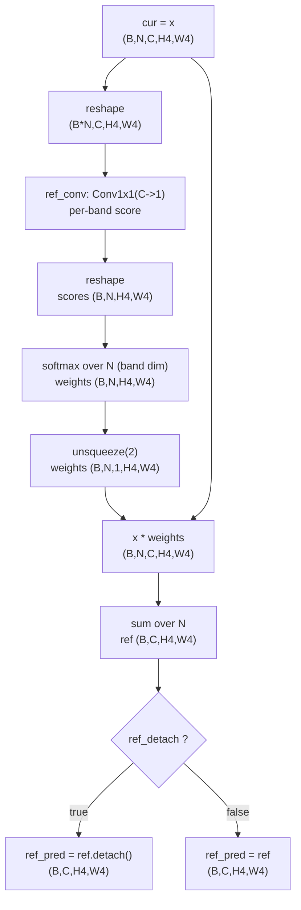
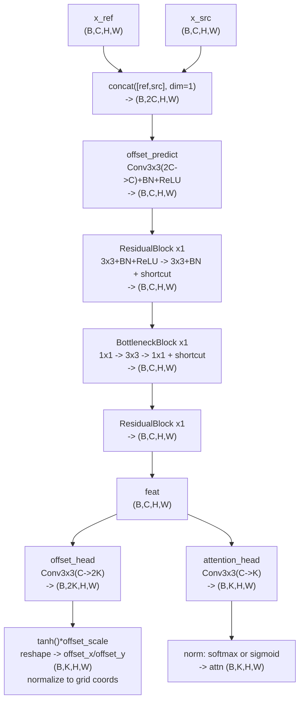
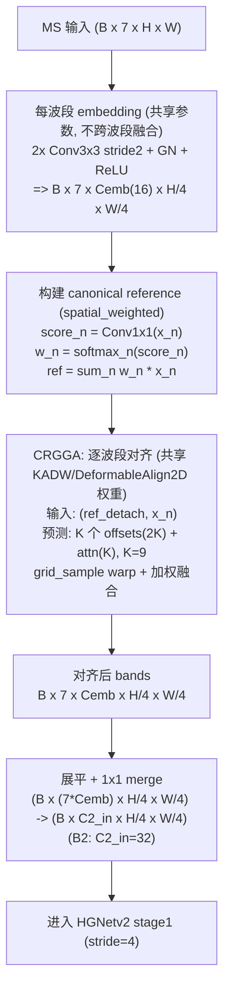
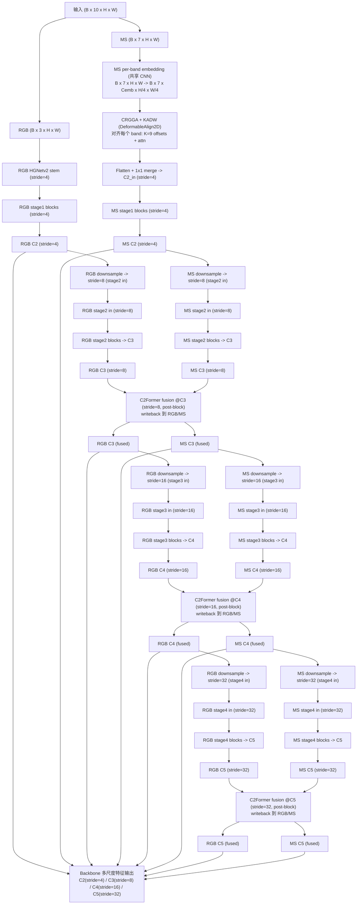

# MSBandSeparatedStemAlign + CRGGA（C2 / stride=4）说明（中文）

本文用中文梳理你当前项目的最终配置中，MS 分支的早期对齐模块到底做了什么、插在网络的哪一段、对齐基准来自哪里，以及 offset/attention/损失各自起到什么作用；并同步更新为更“论文友好”的命名。

## 0) 论文命名 vs 代码命名（对照表）

- `DeformableAlign2D`（实现文件：`engines/models/rtmsfdetr/rtdetrv4/engine/backbone/deform_align.py`）
  - 论文名：Keypoint-Attentive Deformable Warping（KADW）
  - 作用：pairwise 对齐器（给定 ref/src 特征图，预测 K 点 offset + attention，然后 `grid_sample` warp）
- `CRGGA`（实现文件：`engines/models/rtmsfdetr/rtdetrv4/engine/backbone/group_deform_align.py`）
  - 论文名：Canonical Reference Guided Groupwise Alignment（CRGGA）
  - 作用：groupwise 对齐器（先从 N 个 band/组构建 canonical reference，再逐 band 调用 `DeformableAlign2D` 对齐到 ref）
  - 兼容性：代码里仍保留旧名别名/注册名 `GroupwiseDeformableAlign2D`（不影响现有配置与旧代码）
- `ProjectedCRGGA`（同文件）
  - 作用：把普通 BCHW 特征先投影成 N 组再做 CRGGA，对齐后投影回去并残差相加
  - 兼容性：保留旧名 `ProjectedGroupwiseDeformableAlign2D`

最终讨论配置（你已 commit，作为后续论文/复现实验的入口）：

- task config：`configs/task/rtmsfdetr/oil_rgb_msi_20260115/rtmsfdetr_oil_rgb_msi_20260115_det_rtv4_hgnetv2_m_distill_dualstream_c2former_postblock_add_wbadd_c3c4c5_msbandsep_c2align_infonce_reg(915-780).yaml`
- 关键开关：
  - `model.backbone_ms_band_sep.enabled=true`（启用 MSBandSep + C2/stride=4 对齐）
  - `model.backbone_fusion.position=post_block`（C2Former 在各 stage blocks 之后融合）
  - `model.backbone_fusion.fuse_stage_idx=[c3,c4,c5]`

## 1) 指标快照（test）

该最终配置文件名后缀 `(915-780)` 对应你记录的 test 指标（all）：

- `mAP@50≈0.915`，`mAP@50:95≈0.780`

## 2) 这套 “EDA/早期对齐” 在本项目里指什么（先避免概念混淆）

你这个最优配置里所谓的 EDA，并不是 MRT-DETR 论文里“可见光 vs 红外”两模态的 pairwise EDA，而是：

- MS 模态内部（7 个波段）做 reference-free 的 groupwise 对齐（CRGGA）
- 不指定固定参考波段，而是从 7 个波段特征里学习出一个 canonical reference feature map
- 对齐发生在 MS 分支 very-early 的 stride=4 特征图（可理解为 “C2 级别/浅层语义”）

同时，这个最终配置中：

- `model.backbone_align`（alignmsin 那套“选某个 ms_channel 作为参考”的对齐）没有启用
- `model.backbone_group_align`（`ProjectedCRGGA`/`ProjectedGroupwiseDeformableAlign2D` 那套“投影成 groups 再对齐”的模块）也没有启用
- 所以 MS 的对齐只来自 `model.backbone_ms_band_sep.align` 这一路（MSBandSeparatedStemAlign + CRGGA）

## 3) 插入位置：是不是在原图对齐？

不是在原始图像像素上直接对齐；它是在 MS 分支的特征图上做对齐。

MS 分支的数据形状（关键）：

- MS 原输入：`B x 7 x H x W`
- 经过 per-band embedding 后：`B x 7 x Cemb x (H/4) x (W/4)`（stride=4）
- CRGGA 对齐发生在这个 stride=4 的 feature grid 上
- 对齐完成后再 merge 成 HGNetv2 stage1 期望的输入通道数（例如 HGNetv2-B2 的 stage1 in=32），然后进入 HGNetv2 的 stage1 blocks

因此：

- offset 是 dense pixel-level 的，但这里的 “pixel” 指的是 stride=4 特征图的网格点，不是原图像素点
- warp 由 `grid_sample` 完成，是连续坐标双线性采样，所以对齐是“可亚像素”的

## 4) 模块结构（从输入到输出完整路径）

整体路径在 `engines/models/rtmsfdetr/rtdetrv4/engine/backbone/ms_band_sep.py`（MSBandSeparatedStemAlign）里：

1) Per-band embedding（共享小 CNN，不跨波段融合）
2) CRGGA：canonical reference + groupwise 对齐（内部用 KADW/DeformableAlign2D 做逐 band warp）
3) Flatten + 1x1 merge 回 HGNetv2 的 stage1 输入通道数

### 4.1 Per-band embedding 为啥“不跨波段”？

它不是对 `B x 7 x H x W` 做 `Conv2d(in_channels=7, ...)`，而是先把 “band 维(7)” 当作 batch 拆开：

- 输入：`B x 7 x H x W`
- reshape：`(B*7) x 1 x H x W`
- 用同一个小 CNN 处理（参数共享，且 `in_channels=1`）
- reshape 回：`B x 7 x Cemb x (H/4) x (W/4)`

所以卷积核永远只看单 band 的 1 个输入通道，不可能做跨 band 的加权求和，避免“错位叠加式的早期融合”。

补充：

- 当前实现使用 GroupNorm（GN），它是 per-sample 归一化，不依赖 batch running stats，因此不会像 BN 那样在 `(B*7)` 维度上混合统计量
- 真正的跨波段融合发生在后面的 merge：把 `7*Cemb` 展平成通道，再用 `1x1 conv` 压回 C2_in

### 4.2 Canonical reference 是怎么来的（CRGGA 的 ref_mode=spatial_weighted）

CRGGA 的核心是：先构造一个 `ref`，再把每个 band 都对齐到 `ref`（避免固定参考波段）。

当 `ref_mode=spatial_weighted` 时：

- 对每个 band 的特征 `x_n`（`B x Cemb x H4 x W4`）用 `Conv1x1` 产生 score map：`s_n`（`B x 1 x H4 x W4`）
- 对每个位置 `(h,w)` 在 band 维做 softmax：`w_n(h,w) = softmax_n(s_n(h,w))`
- reference：`ref(h,w) = sum_n w_n(h,w) * x_n(h,w)`（输出 `B x Cemb x H4 x W4`）

直觉：reference 可以按位置自适应，不同区域可能由不同波段更可靠。

#### 4.2.0 `ref_pred` 的计算流程图（对应真实代码）

代码位置：

- `ref`：`engines/models/rtmsfdetr/rtdetrv4/engine/backbone/group_deform_align.py:156`（`CRGGA._compute_reference`）
- `ref_pred`：`engines/models/rtmsfdetr/rtdetrv4/engine/backbone/group_deform_align.py:205`（`ref.detach()` 开关）

注意：这里的输入是 **对齐前的 MS embedding 特征**（`cur`），不是原始 MS 图像；因此分辨率是 `stride=4`。



#### 4.2.1 reference 的形状：每个样本只有一个 canonical reference

输入 `x` 的形状是 `B x N x C x H x W`，其中 `N` 是 band 数。

CRGGA 会沿着 band 维 `N` 做聚合，得到：

- `ref` 形状为 `B x C x H x W`

也就是说：**对齐参考图只有一个（没有 N 这一维）**；但它仍然是一个完整的多通道特征图（含 `C,H,W`）。

#### 4.2.2 为什么“未完全对齐”的加权融合 ref 也能作为参考？

可以把 `ref` 理解为一个可学习的 “canonical 模板/隐变量”，它不要求一开始就完美对齐。之所以可用，关键原因是：

1) 去掉 “固定参考 band” 的偏置  
   不指定某个 band 永远当 reference，可以避免把几何误差/噪声锚定在某个 band 上；canonical reference 更像一个中性的坐标系。

2) `spatial_weighted` 能做“按位置选 band”  
   `ref(h,w)=sum_n w_n(h,w)*x_n(h,w)`，其中 `w_n(h,w)` 在 band 维做 softmax。它不是简单平均，而是倾向于在每个位置更相信更“可靠”的 band，从而让 ref 更稳、更不容易被某个 band 的局部噪声拖糊。

3) 对齐过程会反过来让 ref 变得更好（可迭代时更明显）  
   每个 band 都被 KADW（`DeformableAlign2D`）对齐到 ref；当 `num_iters>1` 时，对齐后的 `cur` 会更一致，再用它重算 `ref`，新一轮会得到更“清晰/更一致”的 reference，再继续细化对齐（有点类似 EM 的交替优化直觉）。

4) `ref_detach` 用于稳定训练  
   预测 offset/attn 的输入用 `ref.detach()` 可以减少 “ref 作为输入不断变化” 带来的追逐震荡；但 `ref` 仍会通过对齐损失被间接优化成更适合作为 reference 的表示。

### 4.3 KADW（DeformableAlign2D）的 offset/attention/warp 到底是什么

对每个 band `x_n`，CRGGA 会用同一个 `DeformableAlign2D`（共享参数）去预测该 band 相对于 reference 的形变采样参数：

- 输入：`concat([ref_pred, x_n])`（channel 维拼接）
- 输出：
  - `offset_x, offset_y`：每个位置有 `K=num_keypoints` 组二维采样偏移（你这里 `K=9`）
  - `attn`：每个位置对 K 个采样点的权重（你这里 `attention_norm=softmax`，所以 K 维归一/和为 1）
- warp：对每个位置 `(h,w)`，在 `x_n` 上采样 K 次（采样点坐标 = base_grid + offset），再用 `attn` 做加权融合，得到对齐后的 `aligned_n`

#### 4.3.1 如果输入是 BCHW：offset 到底是什么、是什么维度？

先只看 KADW/`DeformableAlign2D` 的 **pairwise 对齐**（不涉及 CRGGA 的 N 维）。

给定：

- `x_ref`: `B x C x H x W`（参考特征图）
- `x_src`: `B x C x H x W`（待对齐特征图）

`predict(x_ref, x_src)` 输出（最常用的 `per_channel_offset=False` 情况）：

- `offset_x`: `B x K x H x W`
- `offset_y`: `B x K x H x W`
- `attn`: `B x K x H x W`

这里的含义是：

- 对于每个输出位置 `(h,w)`（这个位置是在 reference 的网格上），模型给出 **K 个候选采样点**。
- 第 k 个候选采样点的二维偏移是 `(offset_x[b,k,h,w], offset_y[b,k,h,w])`。
- 这些 offset 最终会被用在 `grid_sample` 的采样网格上，所以它们是 “网格坐标增量”。

在代码实现里（`DeformableAlign2D`）offset 的数值经历了两次尺度：

1) 网络先预测“像素单位”的位移，并用 `tanh` + `offset_scale` 限幅（范围大致是 `[-offset_scale, offset_scale]` 个 feature pixel）
2) 再除以 `(W-1)/2`、`(H-1)/2`，把位移换成 `grid_sample` 需要的 `[-1,1]` 归一化坐标增量

所以你最终拿到的 `offset_x/offset_y` 可以理解为：

- “在归一化坐标系里，每个位置要去 src 的哪个地方取特征”的增量

#### 4.3.2 它怎么用 offset 实现配准（registration）？

关键点：它做的是 **backward warping（反向采样/拉取）**。

它不会把 src 的像素“推过去”（forward warp），而是对输出网格上每个位置 `(h,w)`，去 src 上“拉取”一个值：

1) 构造 reference 网格 `base_grid`（每个位置一个归一化坐标 `(x,y)`），形状：

- `base_grid`: `B x H x W x 2`

2) 对每个 keypoint k，把 `base_grid` 加上 `(offset_x[k], offset_y[k])` 得到采样网格：

- `grid_k[b,h,w] = base_grid[b,h,w] + (offset_x[b,k,h,w], offset_y[b,k,h,w])`
- `grid_k` 形状：`B x H x W x 2`

3) 用 `grid_sample` 在 `x_src` 上按 `grid_k` 采样得到第 k 个候选特征图：

- `sample_k = grid_sample(x_src, grid_k)`，形状：`B x C x H x W`

4) 把 K 个候选结果用 `attn` 做加权融合（softmax 时 `sum_k attn=1`）：

- `x_aligned[b,:,h,w] = sum_k attn[b,k,h,w] * sample_k[b,:,h,w]`
- 输出 `x_aligned`: `B x C x H x W`

你可以把它看成：“每个位置有 K 个可学习的采样点，从 src 上取 K 次，再加权合成一个对齐后的值”。

#### 4.3.3 为什么这样就能学到对齐？（offset 学出来靠什么）

它能实现对齐的根本原因是：

- `grid_sample` 对采样坐标是可微的（differentiable）
- 训练时你会对 `x_aligned` 和 `x_ref` 施加“相似性约束”（cosine / InfoNCE）

于是反向传播会告诉网络：

- “如果你把采样点往某个方向挪一点，`x_aligned` 会更像 `x_ref`（loss 变小）”
- 网络就会逐步把 `(offset_x, offset_y)` 调整到能让两者更匹配的位置

一个最直观的例子（平移）：

- 如果真实情况是 `x_src` 相对 `x_ref` 整体右移了 2 个 feature pixel
- 那么想让输出位置 `(h,w)` 对齐到 reference，就应该去 src 的 `(h, w+2)` 采样
- 学到的 offset 就会趋向于 `offset_x ≈ +2`（再换算成归一化坐标增量），并且 attention 会把权重集中到“接近这个平移量”的 keypoint 上

#### 4.3.4 K=9 是“9 个候选采样点”，不是固定 9 个方向

`K=9` 只是说每个位置有 9 个候选采样点：

- 它们的方向/长度都是网络预测出来的连续值
- attention 决定这 9 个点如何组合（softmax 时相当于做一个凸组合）

关于“每个像素是不是有 9 个方向的偏移选项？”更精确的描述是：

- 每个位置有 9 个“候选采样偏移向量”，但不是固定方向（不是 3x3 邻域的离散方向），而是网络预测的连续 (dx,dy)
- 这 9 个候选点会被 attention 加权融合，所以更像“多点可变形重采样/聚合”，而不是“9 选 1”的硬选择
- 在 MSBandSeparatedStemAlign 的用法里 `per_channel_offset=False`，所以这组 offset 对该 band 的 Cemb 个通道是共享的（对齐发生在几何坐标层面）

offset 的尺度：

- 先是 `tanh(...) * offset_scale`（你这里 `offset_scale=3.0`，可理解为 stride=4 特征图上最多约 3 个“特征像素”的位移能力）
- 再除以 `(w-1)/2,(h-1)/2` 归一化到 `grid_sample` 的 `[-1,1]` 坐标系

#### 4.3.5 offset_head / attention_head 是如何实现的？分别起什么作用？

在代码里（`DeformableAlign2D`），offset/attention 不是直接从 `x_ref/x_src` 预测的，而是先做一段共享的特征提取，再分成两个 head：

1) 共享特征提取（trunk）  
   输入先在 channel 维拼接：`concat([x_ref, x_src]) -> (B,2C,H,W)`，经过几层卷积/残差块得到 `feat (B,C,H,W)`。  
   直觉：让网络先把 “两者哪里不一致/哪里该对齐” 的信息编码进一个中间表征 `feat`。

2) `offset_head`：预测 “去哪里取”  
   实现是一个 `Conv2d(C, 2K, 3x3)`（常用 `per_channel_offset=False` 时），输出 `2K` 个通道，代表每个 keypoint 的 `(dx,dy)`。  
   后处理包括：
   - `tanh * offset_scale`：限制最大位移，避免一开始形变过大
   - reshape 拆成 `offset_x/offset_y`，并换算到 `grid_sample` 的归一化坐标增量  
   作用：决定每个位置的 K 个候选采样点坐标，也就是配准的“几何部分”。

3) `attention_head`：预测 “怎么混”  
   实现是一个 `Conv2d(C, K, 3x3)`，输出每个位置对 K 个采样点的权重（或权重 logits）。  
   常用两种归一方式：
   - `softmax`：对 K 维归一化（和为 1），更像在 K 个候选点之间做软选择/凸组合
   - `sigmoid`：每个 keypoint 独立 gating（和不固定），通常需要额外的 attention sum/entropy 正则来稳定  
   作用：在 K 个候选采样点中“抑制错的、强调对的”，并允许把多个候选点做加权融合，减少错采样带来的不稳定/模糊。

4) 初始化为什么重要（为什么它不会一开始就把特征弄乱）  
   - `offset_head` 权重/偏置初始化为 0：初始 `offset=0`，warp 近似恒等映射（先不动，再慢慢学会动）
   - `attention_head` 初始化成接近均匀：避免一开始某个 keypoint 权重过大导致训练不稳定  

一句话：`offset_head` 学 “几何对齐（采样点坐标）”，`attention_head` 学 “多点采样的融合/选择”，两者一起才形成稳定可学的对齐模块。

#### 4.3.6 offset head / attention head 的内部结构图（对应真实代码）

对应实现文件：`engines/models/rtmsfdetr/rtdetrv4/engine/backbone/deform_align.py` 的 `DeformableAlign2D.predict()`。

说明：

- 下面这张图展示的是 **“预测 offset/attn 的网络结构”**（trunk + 两个 head），不是 `grid_sample` 的采样过程本身。
- 本项目在 CRGGA 中固定 `per_channel_offset=False`，因此输出 offset 是 `(B,K,H,W)`（同一 band 内所有通道共享同一个几何 warp）。



#### 4.3.7 常见误解澄清：9 个方向？会不会冲突？反向采样是什么？

1) “每个像素可以在 9 个位置移动/8 个方向 + 中心点吗？”

- 更准确的说法：**每个输出位置会从 src 上“查询”K=9 个连续坐标的候选采样点**，再用 attention 加权融合成该位置的输出。
- 这 9 个 offset 不是固定的 8 个离散方向，而是网络回归出来的连续 `(dx,dy)`；方向与长度都可变。

2) “像素之间的位移会冲突吗？”

- 在这里不会出现 forward-warp 那种“推过去覆盖/空洞”的冲突，因为实现是 **反向采样（backward warping / pull）**：
  - 输出网格 `(h,w)` 是固定的；
  - 每个输出位置只是在输入(src)上找坐标取样；
  - 因此天然不会有“没人填的洞”，但允许 many-to-one（多个输出位置采到同一个输入位置），这是采样映射的正常结果。

3) “所以这不算对齐，只是在找采样点？”

- KADW/CRGGA 的“对齐”就是用可微采样实现的：网络学习一个位移场，让 warp 后的 `x_aligned` 与 `ref` 在特征空间更一致（cosine/InfoNCE）。采样点是实现手段，目标是**配准后的特征一致性**。
- C2Former 的 offset 虽然也表现为采样点偏移，但目的更偏“融合时如何取对方信息”；CRGGA 的 offset 则是“把同一模态内部的几何结构拉齐到同一坐标系”。

#### 4.3.8 CRGGA 是“全局对齐”还是“逐通道对齐”？

在你当前实现里（CRGGA + KADW）：

- **不是全局一次变换**（不是单一平移/仿射），而是 **稠密（每像素）非刚性对齐**：每个位置都有自己的 offset 与 attention。
- **也不是逐通道一套不同 offset**：CRGGA 内部固定 `per_channel_offset=False`，因此同一 band 内所有通道共享同一套采样坐标（同一几何 warp）。
- 但 KADW 的预测网络本身是卷积网络，offset/attn 是由局部邻域特征决定的，所以它能表达局部错位（不是“全局”）。

#### 4.3.9 CRGGA 之后再用卷积融合，会不会重新引入未对齐误差？

不会“凭空制造新的几何错位”，但会把 **CRGGA 没对齐干净的残留误差**带入后续计算：

- 卷积/归一化/GELU(或ReLU)/... 不会给不同通道施加不同几何位移，因此不会产生新的空间错位。
- 你这个 stem 里 CRGGA 后首先是 `1x1 conv` merge（只做同一位置的通道混合，不跨空间邻域），不会引入新的空间错位；但如果对齐残留存在，通道混合会把残留不一致一起融合进去，表现为局部边缘变糊/对比下降。
- 后续 backbone 的 `3x3` 等卷积会进一步在空间邻域聚合：若残留错位很大，确实可能造成特征更难学；但端到端训练会反向驱动 CRGGA 的 offset 继续降低这种残留。

### 4.4 offset 能否理解为“弹性形变”？

可以类比为弹性/非刚性对齐的位移场（learned nonrigid warping），但不要写成严格物理意义的弹性形变：

- offset 是学习到的采样偏移（deformable warping offsets），目标是让 `aligned_n` 在特征层面对齐 `ref`
- 没有显式的物理弹性约束（连续性/可逆性/体积保持等）；平滑性更多来自卷积结构 + offset 幅度限制 + offset/attention 正则

### 4.5 为什么该最终配置没有 affine？

因为 `affine_enabled` 没配置，默认是关闭的；所以这里只有 KADW 的 deformable offsets，没有 translation/affine head。

## 5) 该最终配置的 CRGGA 配置（逐项解释）

来自最终 task config 的关键片段（`model.backbone_ms_band_sep`）：

```yaml
backbone_ms_band_sep:
  enabled: true
  embed_channels: 16        # Cemb
  embed_use_bn: true
  align:
    enabled: true
    ref_mode: spatial_weighted
    ref_detach: true
    num_iters: 1
    num_keypoints: 9
    offset_enabled: true
    offset_scale: 3.0
    attention_norm: softmax
    padding_mode: border
    align_corners: true
    loss_type: infonce
    loss_downsample: 0.5
    nce_patch_size: 5
    nce_num_patches: 64
    nce_tau: 0.2
    loss_weight: 0.02
    loss_offset_weight: 0.01
    loss_attn_entropy_weight: 0.001
```

你问得最多的几个参数：

- `Cemb=16`：每个波段在对齐前的特征通道数（embedding 维度）。越大表达力越强、计算越大。
- `num_keypoints=9`：每个位置采样 9 个候选偏移点（连续可学习，并非固定 9 个方向）。
- `offset_scale=3.0`：控制最大位移幅度（以 stride=4 的 feature pixel 为单位）。
- `attention_norm=softmax`：对 9 个采样点做归一权重，避免 sigmoid 造成总权重漂移。
- `loss_type=infonce`：用 patch InfoNCE 做对齐监督（对 MS 这种光谱差异大、强度不一致的情况通常比纯 cosine 更稳）。
- `loss_weight=0.02`：对齐损失占比很小（避免为了对齐牺牲检测语义）。
- `loss_offset_weight=0.01`：抑制过大 warp（避免破坏性形变）。
- `loss_attn_entropy_weight=0.001`：鼓励注意力更“选择性”，避免 9 点平均造成特征变糊。
- `ref_detach=true`：用 `ref.detach()` 参与 offset/attn 的预测输入（减少 reference 作为输入不断变化导致的不稳定），但 reference 仍用于对齐损失。

## 5.1) 常见混淆：CRGGA/KADW 的 offset vs C2Former 的 offset

1) CRGGA/KADW（本文这部分） 的 offset：
   - 配置位置：`model.backbone_ms_band_sep.align.offset_enabled/offset_scale`
   - 作用：在 stride=4 的 MS 特征图上生成采样网格偏移，用 `grid_sample` 做 warp（几何重采样），把每个 band 对齐到 canonical reference。

2) C2Former（跨模态融合） 的 offset：
   - 配置位置：`model.backbone_fusion.offset_range_factor / no_offset / offset_on ...`
   - 作用：在 c3/c4/c5 的融合注意力里决定“采样点偏移/范围”（更像 deformable attention 的 offset），用于 RGB/MS 两路特征融合，并不是对原特征图做显式的 `grid_sample` warp。

简单记忆：

- CRGGA/KADW offset = “先对齐再提特征”（warp 对齐）
- C2Former offset = “融合时怎么采样对方特征”（注意力采样偏移）

## 6) 为什么这套配置在你的数据上更容易好（经验解释）

结合你跑过的变体（conservative / ref_global / affine_only），这套 baseline 更容易占优的原因通常是：

1) `spatial_weighted` reference 更贴合多光谱：同一张图不同区域由不同波段更“可信”，按位置自适应比全局一个权重更合理。
2) KADW 的 deformable warping（K=9, offset_scale=3）能处理“局部不完全对齐”，而 translation-only affine 往往太刚性。
3) 约束强度适中：对齐损失权重小 + 有正则，既能拉齐又不至于把检测训练拖偏。

另外要注意：如果你用同一份 YAML 多次训练，最终 mAP 仍可能受 seed/dataloader 顺序/AMP 数值等影响而有波动；这属于训练随机性，不是配置字段本身变化。

## 7) 结构图（Mermaid，可直接在支持 Mermaid 的 Markdown 里渲染）

### 7.1 MS 分支 CRGGA 模块（替换 MS stem）



### 7.1.1 `ms_band_sep_stem`（MSBandSeparatedStemAlign）详细结构图（含卷积/激活与特征图变化）

实现文件：`engines/models/rtmsfdetr/rtdetrv4/engine/backbone/ms_band_sep.py`

你这个最终配置里：

- `ms_in_chs=7`
- `embed_channels=Cemb=16`
- `align.enabled=true`（启用 CRGGA）
- `c2_in_channels=C2_in=32`（HGNetv2-B2 stage1 入口通道）

下面是 **严格按当前代码** 的结构（包含 reshape、卷积、GN、激活）：

```text
MSBandSeparatedStemAlign (aka ms_band_sep_stem)

Input:
  ms: (B, 7, H, W)

1) Shared per-band embedding  (A: keep "band dim" explicit; no cross-band mixing)
  reshape: (B, 7, H, W) -> (B*7, 1, H, W)

  Conv2d(1  -> 16, k=3, s=2, p=1, bias=False) -> (B*7, 16, H/2, W/2)
  GroupNorm(groups=4, channels=16)
  ReLU

  Conv2d(16 -> 16, k=3, s=2, p=1, bias=False) -> (B*7, 16, H/4, W/4)
  GroupNorm(groups=4, channels=16)
  ReLU

  reshape back: (B*7, 16, H/4, W/4) -> z: (B, 7, 16, H/4, W/4)

2) CRGGA alignment on (B, N=7, C=16, H/4, W/4)  (optional but enabled in this config)
  2.1) Canonical reference (ref_mode=spatial_weighted)
    for each band n:
      score_n = Conv2d(16 -> 1, k=1, s=1, p=0, bias=True)(z_n)      -> (B, 1, H/4, W/4)
    stack scores: (B, 7, H/4, W/4) -> softmax over band dim -> w: (B, 7, H/4, W/4)
    ref = sum_n w_n * z_n                                                  -> (B, 16, H/4, W/4)

  2.2) Per-band KADW/DeformableAlign2D (shared weights for all 7 bands)
    for each band n:
      input: ref_pred (detach) and src=z_n
      predict: offsets (dx,dy) for K=9 + attention weights over K
      warp: grid_sample(src, base_grid + offsets) for K points, then weighted sum -> aligned_n: (B, 16, H/4, W/4)
    stack aligned bands -> z_aligned: (B, 7, 16, H/4, W/4)

  (KADW 的 offset/attn trunk+heads 结构详见本文 4.3.6)

3) Merge to HGNetv2 stage1 input channels (C2_in)
  flatten band dim into channel:
    (B, 7, 16, H/4, W/4) -> (B, 112, H/4, W/4)

  Conv2d(112 -> 32, k=1, s=1, p=0, bias=False) -> (B, 32, H/4, W/4)
  GroupNorm(groups=8, channels=32)
  ReLU

Output:
  y: (B, 32, H/4, W/4)   # feed into HGNetv2 stage1 blocks (stride=4 / C2 level)
```

一个很重要的结论（和你前面问的 offset/通道关系直接相关）：

- 由于 CRGGA 内部固定 `per_channel_offset=False`，所以 **同一个 band 内 16 个通道共享同一套 K=9 的采样坐标与注意力**；差别来自各通道的特征响应，不来自“每通道不同的 offset”。

## 8) 如何在真实输入上可视化 CRGGA 效果（推荐）

已提供一个 one-off 工具脚本：`tools/vis_crgga_on_pair.py`。它会只运行 MSBandSeparatedStemAlign（per-band embedding + CRGGA），并保存特征级可视化结果（最贴合模块真实行为）。

使用方式（给定一对输入路径：RGB + 7-band MS）：

```bash
python tools/vis_crgga_on_pair.py \
  --rgb /abs/path/to/xxx_rgb.png \
  --ms  /abs/path/to/xxx_ms.tif
```

可选参数：

- `--checkpoint /abs/path/to/checkpoint_best.pth`：指定你要用的训练权重（默认指向 oil 最终 post_block+msbandsep 配置的一个 checkpoint）。
- `--outdir outputs/vis_crgga/<name>`：输出目录（默认：`outputs/vis_crgga/<ms文件名>_YYYYMMDD-HHMM`，自动加时间后缀避免覆盖）。
- `--device auto|cpu|cuda`：运行设备（默认 auto）。
- `--ms_fixed_scale 65535`：MS 归一化 scale（oil 数据集默认 16-bit tif，训练时做 `ms/65535` 并 clamp 到 [0,1]）。

输出文件（在 outdir 下）主要包括：

- `embed_before_mean.png` / `embed_after_mean.png`：对齐前/后的 per-band embedding 特征可视化（stride=4，按通道均值成单通道图）。
- `cos_to_ref_before.png` / `cos_to_ref_after.png` / `cos_to_ref_delta.png`：与 canonical reference 的 cosine 相似度变化（直接体现“更一致/更对齐”）。
- `flow_mag_feature_px.png`：attention 加权后的期望位移幅度（单位是 stride=4 的 feature pixel）。
- `attn_entropy.png`：attention 熵（越低越“选点”，越高越平均）。
- `ref_weights.png` / `ref_choice_argmax.png`（仅 spatial_weighted）：reference 在 band 维的像素级选择/权重分布。
- `crgga_debug_arrays.npz`：把上述中间量保存为数组，便于你后续做更细的分析/画图。

注意：这些可视化展示的是 **CRGGA 在特征空间（stride=4）做的对齐**，不是直接对原图像素做配准；因此不要把位移场当作严格的“原图光流”解读。

### 7.2 双流结构里的插入位置（细化：C2 + C2Former）

说明：

- 这里的 “C2/C3/C4/C5” 按 stride 对应：`C2=4, C3=8, C4=16, C5=32`
- 本最终配置里 C2Former 的融合位置是在 “每个 stage 的 blocks 之后（post-block）”，因此更贴近 “stage_out 特征”的融合（更接近你写在 YAML 注释里的 stage_end fusion）


