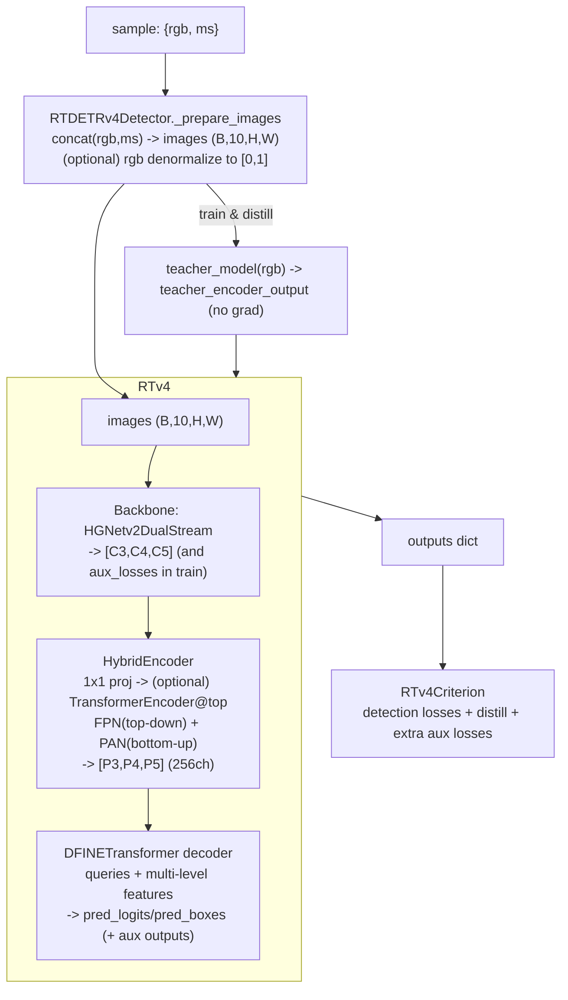
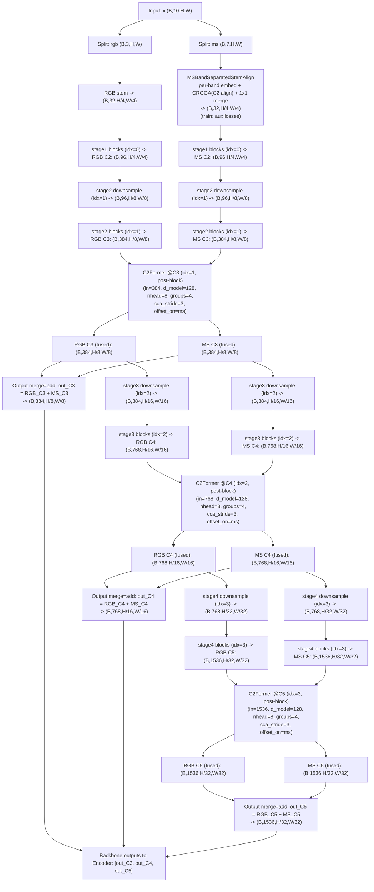
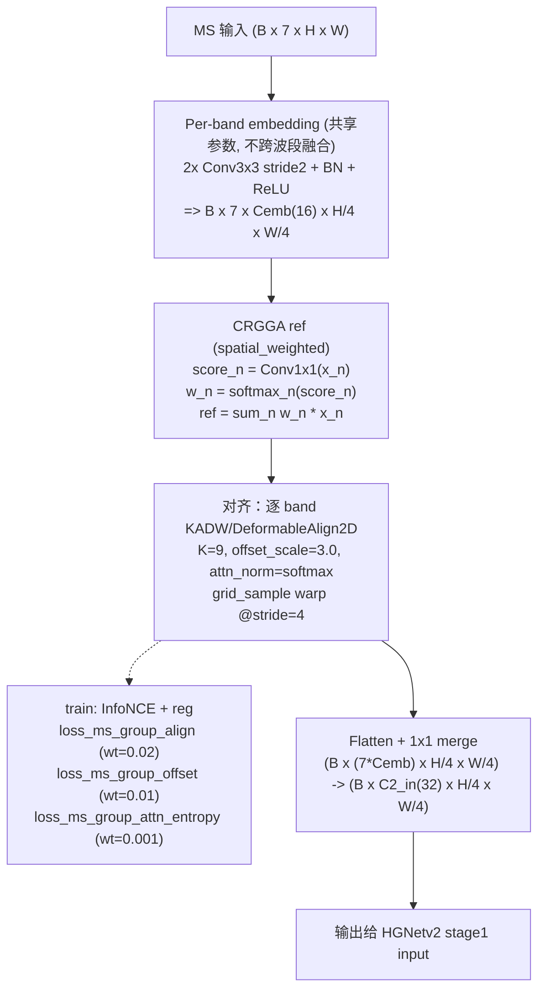
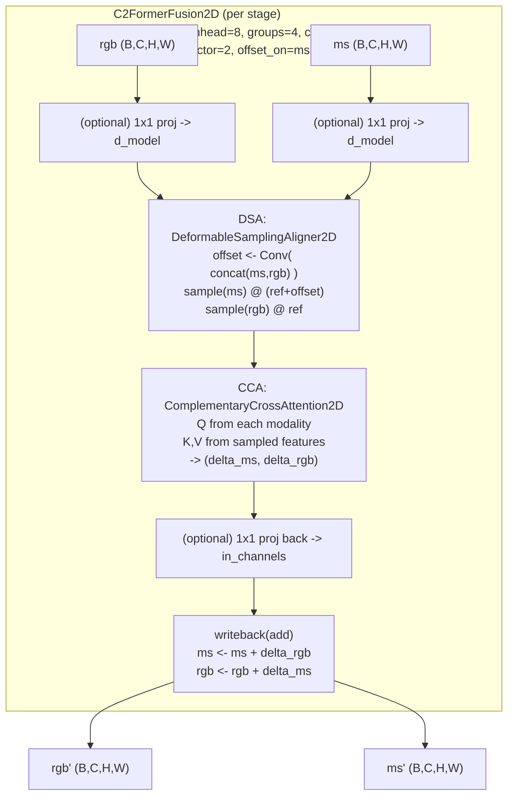

# RTMSFDETR（RT-DETRv4）HGNetv2-M(B2) DualStream + MSBandSep(C2Align) + C2Former(C3/C4/C5) 结构解析与流程图

本文基于以下 task 配置，分析 `engines/models/rtmsfdetr` 的整体结构，并重点梳理**双流骨干网络 `HGNetv2DualStream`** 的结构与数据流（含 MSBandSep 的 C2 对齐，以及 C2Former 在 C3/C4/C5 的融合位置）。

对应配置：

- task config：`configs/task/rtmsfdetr/oil_rgb_msi_20260115/rtmsfdetr_oil_rgb_msi_20260115_det_rtv4_hgnetv2_m_distill_dualstream_c2former_postblock_add_wbadd_c3c4c5_msbandsep_c2align_infonce_reg(915-780).yaml`

关键代码入口（建议按这个顺序看）：

- 模型构建与 override：`engines/models/rtmsfdetr/builder.py`
- RT-DETRv4 兼容封装（输入拼接/反归一化/teacher）：`engines/models/rtmsfdetr/rtdetrv4_detector.py`
- RTv4 主模型（backbone->encoder->decoder）：`engines/models/rtmsfdetr/rtdetrv4/engine/rtv4/rtv4.py`
- 双流骨干实现：`engines/models/rtmsfdetr/rtdetrv4/engine/backbone/hgnetv2_dualstream.py`
- MSBandSep + CRGGA：`engines/models/rtmsfdetr/rtdetrv4/engine/backbone/ms_band_sep.py`、`engines/models/rtmsfdetr/rtdetrv4/engine/backbone/group_deform_align.py`
- C2Former：`engines/models/rtmsfdetr/rtdetrv4/engine/backbone/c2former_fusion.py`
- 额外对齐损失收集：`engines/models/rtmsfdetr/rtdetrv4/engine/rtv4/rtv4_criterion.py`

相关补充文档（可选）：

- `docs/msbandsep_c2_crgga_kadw.md`：MSBandSep + CRGGA/KADW + InfoNCE 的细节解释
- `docs/c2former_fusion.md`：C2Former 的 DSA + CCA 结构细节

## 0) RTMSFDETR 整体结构（顶层数据流）

从工程结构看，`rtmsfdetr` 是把 vendored RT-DETRv4 (`RTv4`) 包起来，适配本工程的数据输入与训练逻辑：

1) 数据样本通常是 dict：`{"rgb":..., "ms":...}`（或直接是拼接好的 Tensor）
2) `RTDETRv4Detector._prepare_images()` 会按 `rgb -> ms` 顺序拼接通道，得到 `images(B,10,H,W)`
3) `RTv4.forward()`：`HGNetv2DualStream(backbone) -> HybridEncoder(encoder) -> DFINETransformer(decoder)`
4) backbone 的对齐正则（本配置的 infonce_reg）以 **aux loss** 的形式回传给 `RTv4Criterion`

## 1) 该配置下的关键结构参数（从 YAML 抽出来）

来自 task config（核心只看 `model:` 这一段）：

- 输入：RGB + MSI 堆叠，`B x 10 x H x W`（其中 RGB=3ch，MS=7ch）
- 双流 backbone：`model.dual_stream_backbone=true`
- 输出 merge：`model.backbone_output_merge=add`（最终输出给 Encoder 的特征：RGB+MS 按元素相加）
- 跨模态融合（C2Former）：
  - `model.backbone_fusion.type=c2former`
  - `model.backbone_fusion.position=post_block`（在每个 stage 的 blocks 之后融合）
  - `model.backbone_fusion.fuse_stage_idx=[c3,c4,c5]`（映射为 stage_idx=[1,2,3]）
  - `d_model=128, nhead=8, groups=4, cca_stride=3, offset_range_factor=2, no_offset=false, offset_on=ms`
- MSBandSep(C2 对齐)：
  - `model.backbone_ms_band_sep.enabled=true`
  - per-band embed：`embed_channels=16, embed_use_bn=true`
  - CRGGA 对齐：`ref_mode=spatial_weighted, ref_detach=true, num_iters=1`
  - KADW 核心：`num_keypoints=9, offset_enabled=true, offset_scale=3.0, attention_norm=softmax`
  - InfoNCE：`loss_type=infonce, loss_downsample=0.5, nce_patch_size=5, nce_num_patches=64, nce_tau=0.2`
  - 正则：`loss_weight=0.02, loss_offset_weight=0.01, loss_attn_entropy_weight=0.001`

来自 vendored RT-DETRv4 配置（由 `configs/model/rtmsfdetr/rtv4_hgnetv2_m_distill.yaml` 引用 `.../dfine_hgnetv2_m_coco.yml`）：

- HGNetv2 结构：`HGNetv2.name='B2'`
- backbone 输出层：`HGNetv2.return_idx=[1,2,3]`（只返回 C3/C4/C5）

## 2) stage / C-level / stride 对应关系（HGNetv2-B2）

HGNetv2 的 stage 在代码里是 0-based index（`hgnetv2_dualstream.py` 里叫 `idx`），与常见的 C2/C3/C4/C5 对应如下：

| stage_idx | HGNetv2 stage | stride(输出) | stage_in_channels | stage_out_channels | 检测常用名 |
| --- | --- | --- | --- | --- | --- |
| stem | StemBlock | 4 | in: RGB=3 / MS=7 | out: 32 | C2 的“前一层”(stage1 input) |
| 0 | stage1 | 4 | 32 | 96 | C2 |
| 1 | stage2 | 8 | 96 | 384 | C3 |
| 2 | stage3 | 16 | 384 | 768 | C4 |
| 3 | stage4 | 32 | 768 | 1536 | C5 |

注意两点：

1) “C2” 通常指 **stage1 blocks 的输出**（stride=4，通道=96）；不是 stem 的输出（stem 输出也是 stride=4，但通道=32）。
2) 该配置 `return_idx=[1,2,3]`，所以 backbone 最终只把 **C3/C4/C5** 返回给后续 Encoder；C2 在前向里会算出来，但默认不作为输出使用（除非 `return_idx` 包含 0）。

## 3) 双流 backbone 的计算顺序（对齐代码）

`HGNetv2DualStream.forward()`（见 `hgnetv2_dualstream.py`）的大流程是：

1) 输入 `x(B,10,H,W)` 按通道拆分为 `rgb(B,3,H,W)` 与 `ms(B,7,H,W)`
2) 两路分别过 stem：
   - `rgb = rgb_backbone.stem(rgb)`
   - `ms  = MSBandSeparatedStemAlign(ms)`（本配置启用 `ms_band_sep`，替换原生 MS stem）
3) 进入 4 个 stage 循环（idx=0..3），每个 stage 的固定顺序是：
   - `downsample`
   - `blocks`
   - （若 idx 在 fuse_stage_idx=[1,2,3]）执行 `C2FormerFusion2D`（发生在 blocks 之后，属于 post-block fusion）
4) 对 `return_idx=[1,2,3]` 的 stage 收集 RGB/MS 输出特征
5) 以 `output_merge=add` 合并输出（输出给 Encoder 的是单路特征）：
   - `out_C3 = rgb_C3 + ms_C3`
   - `out_C4 = rgb_C4 + ms_C4`
   - `out_C5 = rgb_C5 + ms_C5`

## 4) 特征图尺寸/通道逐层变化（以符号 H,W 表示）

两路 backbone 的 stage 结构同构（都是 HGNetv2-B2），因此 **RGB/MS 在 stage1..4 的尺寸与通道变化一致**；差别主要发生在 MS 的 stem（是否 band-sep + 对齐）。

### 4.1 RGB 分支（3ch）

- 输入：`B x 3 x H x W`
- stem 输出（stride=4）：`B x 32 x H/4 x W/4`
- stage1 输出（C2, stride=4）：`B x 96 x H/4 x W/4`
- stage2 输出（C3, stride=8）：`B x 384 x H/8 x W/8`
- stage3 输出（C4, stride=16）：`B x 768 x H/16 x W/16`
- stage4 输出（C5, stride=32）：`B x 1536 x H/32 x W/32`

### 4.2 MS 分支（7ch，启用 MSBandSep + C2Align）

- 输入：`B x 7 x H x W`
- MSBandSeparatedStemAlign 输出（stride=4）：`B x 32 x H/4 x W/4`
  - 内部中间态：`B x 7 x 16 x H/4 x W/4`（per-band embedding 后、对齐前/后）
- stage1 输出（C2, stride=4）：`B x 96 x H/4 x W/4`
- stage2 输出（C3, stride=8）：`B x 384 x H/8 x W/8`
- stage3 输出（C4, stride=16）：`B x 768 x H/16 x W/16`
- stage4 输出（C5, stride=32）：`B x 1536 x H/32 x W/32`

### 4.3 C2Former 融合发生在哪些张量形态上？

本配置 `fuse_stage_idx=[c3,c4,c5]` 且 `position=post_block`，融合发生在 stage2/3/4 的 **blocks 之后**，也就是在各 stage 的 “out_channels + 对应 stride” 上：

- C3 融合（stage2 post-block, idx=1）：`B x 384 x H/8 x W/8`
- C4 融合（stage3 post-block, idx=2）：`B x 768 x H/16 x W/16`
- C5 融合（stage4 post-block, idx=3）：`B x 1536 x H/32 x W/32`

融合后张量形状不变；并且 **融合后的输出会作为下一 stage 的输入**（下一 stage 的 downsample 直接接收融合后的特征）。

## 5) 可视化：DualStream + MSBandSep(C2Align) + C2Former(C3/C4/C5) + 输出 merge

下面 Mermaid 图按 `C2(stride=4) -> C3(stride=8) -> C4(stride=16) -> C5(stride=32)` 展开，同时标注每一步对应的 stage。

## 6) 可视化：MSBandSeparatedStemAlign + CRGGA(C2Align) 内部（简化版）

对应代码：`ms_band_sep.py` + `group_deform_align.py`。

## 7) 可视化：C2FormerFusion2D 内部（简化版）

对应代码：`c2former_fusion.py`。该配置 `offset_on=ms`，因此在 DSA 里“带 offset 的采样”作用在 MS（作为 x_a），RGB（x_b）走 reference grid 采样；但 offset 的预测输入是 `concat([x_a,x_b])`（两模态共同决定 offset）。

## 8) 训练时对齐损失如何回传到 Criterion（本配置的 “infonce_reg”）

MSBandSep 的 CRGGA 在训练时会返回 aux losses（key 以 `loss_ms_group_*` 命名）：

- `HGNetv2DualStream.forward()` 会累计这些 aux losses，并返回 `(outs, aux_losses)`
- `RTv4.forward()` 会把 `aux_losses` merge 进输出 dict
- `RTv4Criterion.forward()` 会把这些 key 加进总 loss（如果 `weight_dict` 没有同名项，则按 1.0 权重使用）

这些 loss 的“权重”在 CRGGA 内部已经乘过（如 0.02/0.01/0.001），因此通常不需要再在 `weight_dict` 里重复缩放。

## 9) 常见混淆：CRGGA/KADW 的 offset vs C2Former 的 offset

- CRGGA/KADW offset（本配置发生在 C2/stride=4）：用于 `grid_sample` 的显式 warp，对齐的是 **MS 各 band 之间的几何错位**
- C2Former offset（发生在 C3/C4/C5 的融合模块内）：用于跨模态注意力采样位置的偏移，更接近 “deformable attention 的采样偏移”，不是直接做显式 warp
