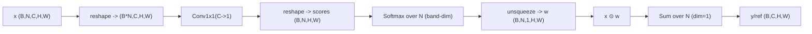
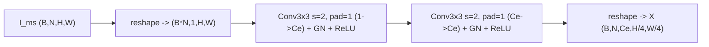
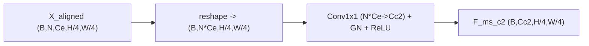
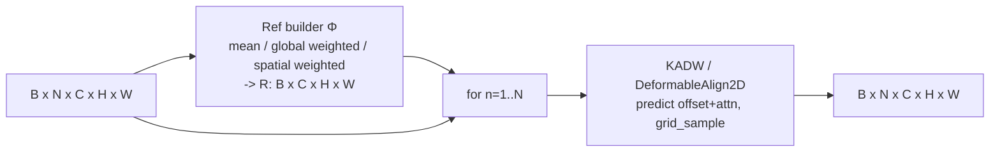
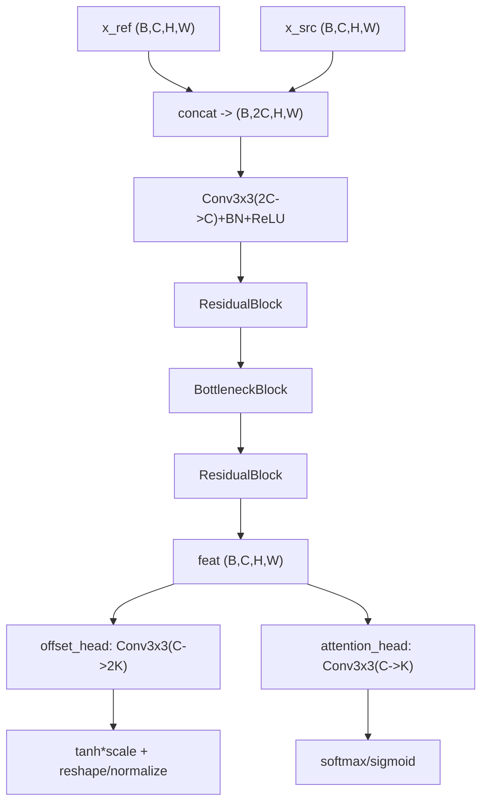

# 论文写法：CRGGA 模块（Canonical Reference Guided Groupwise Alignment）与 KADW 对齐器

本节把你项目里“多光谱 MS 模态不严格对齐”这一真实问题，和当前代码实现（CRGGA + KADW + 双流 C2Former 融合）对齐到论文写法：给出清晰的符号定义、模块功能边界、公式推导、以及和跨模态融合的区别与动机。

> 命名约定：论文中用
> - KADW：Keypoint Attentive Deformable Warping（代码类名仍为 `DeformableAlign2D`，文件 `engines/models/rtmsfdetr/rtdetrv4/engine/backbone/deform_align.py`）
> - CRGGA：Canonical Reference Guided Groupwise Alignment（代码类名为 `CRGGA`，并保留旧名兼容 `GroupwiseDeformableAlign2D`，文件 `engines/models/rtmsfdetr/rtdetrv4/engine/backbone/group_deform_align.py`）
> - SWCR：Spatially Weighted Canonical Reference（代码实现为 `CRGGA` 内部的 `ref_mode=spatial_weighted` 分支：`ref_conv + softmax`）

---

## 0. 基准配置（本文写法对应）

本文默认以你当前的基准实验配置为准（用于对齐命名/模块开关/超参范围）：

- config：`configs/task/rtmsfdetr/oil_rgb_msi_20260115_3cls/rtmsfdetr_oil_rgb_msi_20260115_det_rtv4_hgnetv2_m_distill_dualstream_c2former_postblock_add_wbadd_c3c4c5_msbandsep_c2align_infonce_reg_globalkv_pos2d.yaml`
- 关键开关（只列与 CRGGA + ms_stem 相关部分）：
  - `model.dual_stream_backbone=true`：RGB/MS 双流主干
  - `model.backbone_ms_band_sep.enabled=true`：MS 分支用 `MSBandSeparatedStemAlign` 替换原 HGNetv2 的 `ms_backbone.stem`
  - `model.backbone_ms_band_sep.embed_channels=16`
  - `model.backbone_ms_band_sep.embed_use_bn=true`：代码实现里该开关实际启用的是 `GroupNorm`（保留旧字段名以兼容历史配置）
  - `model.backbone_ms_band_sep.align.enabled=true`：启用 C2/stride=4 的 band-wise 对齐（CRGGA）
    - `ref_mode=spatial_weighted`：即本文的 SWCR（Spatially Weighted Canonical Reference）
    - `ref_detach=true`，`num_iters=1`
    - `num_keypoints=9`，`offset_enabled=true`，`offset_scale=3.0`
    - `attention_norm=softmax`（每像素 \(\sum_k \alpha_k=1\)）
    - `padding_mode=border`，`align_corners=true`
    - `loss_type=infonce`，`loss_downsample=0.5`，`nce_patch_size=5`，`nce_num_patches=64`，`nce_tau=0.2`
    - `loss_weight=0.02`，`loss_offset_weight=0.01`，`loss_attn_entropy_weight=0.001`

> 说明：论文插图中常用 \(K=3\) 仅为示意清晰；基准配置训练/测试用的是 \(K=9\)。

## 1. 背景：多光谱“不严格对齐”的两类问题

在双流 RGB + MS 检测中，常见存在两类“错位”：

1) **模态内对齐（intra-modality alignment）**：MS 内部各波段之间不严格对齐  
例如 7 个波段来自多光谱相机不同通道（光路/传感器位置差异/时间差/畸变差异），导致同一物体边缘在不同波段存在局部位移。  
直接早期融合（把 7 波段当 7 个通道做卷积混合）会产生“错位叠加”，表现为纹理模糊、边缘重影，影响后续 backbone 的表示。

2) **模态间对齐/融合（inter-modality alignment/fusion）**：RGB 与 MS 之间的结构差异与相对错位  
RGB 与 MS 往往来自不同传感器/不同成像机制，几何错位可能更大且随深度变化；同时语义显著性也不同（某些目标在某些波段更突出）。  
此时“强制像素级配准”未必最优，更常用 **注意力式融合**：在语义层对齐信息而非严格对齐像素。

你的当前方案正是把这两类问题拆开处理：

- **CRGGA（模态内）**：只解决 MS 内部 7 波段之间的配准/对齐（在 very-early 的 stride=4 特征上）。
- **C2Former（模态间）**：在 C3/C4/C5 等更高层语义阶段做 RGB↔MS 的互补融合（可带粗对齐采样，但不是严格的全分辨率配准）。

---

## 2. 符号与张量形状（统一论文与实现）

设输入 batch 大小为 \(B\)，MS 波段数为 \(N\)（常见 \(N=7\)），空间尺寸为 \(H\times W\)。

- MS 原图：\(\mathbf{I}^{ms}\in\mathbb{R}^{B\times N\times H\times W}\)
- RGB 原图：\(\mathbf{I}^{rgb}\in\mathbb{R}^{B\times 3\times H\times W}\)

在 MSBandSeparatedStemAlign（你项目的“方案1”MS stem）中：

1) **逐波段 embedding（不做跨 band 混合）**：得到 stride=4 的逐波段特征

实现中先把 band 维当作 batch 展开，再对每个 band 使用同一套轻量 CNN（参数共享）：
$$
\overline{\mathbf{I}}=\mathrm{reshape}(\mathbf{I}^{ms})\in\mathbb{R}^{(BN)\times 1\times H\times W}
$$
$$
\overline{\mathbf{X}}=f_{\text{emb}}(\overline{\mathbf{I}})\in\mathbb{R}^{(BN)\times C_e\times \tfrac{H}{4}\times \tfrac{W}{4}}
$$
$$
\mathbf{X}=\mathrm{reshape}^{-1}(\overline{\mathbf{X}})\in\mathbb{R}^{B\times N\times C_e\times \tfrac{H}{4}\times \tfrac{W}{4}}
$$
其中 \(C_e\) 为每个 band 的 embedding 通道（实现里 `embed_channels`）。基准配置下
$$
f_{\text{emb}}=\underbrace{\mathrm{Conv}_{3\times 3}^{s=2}+\mathrm{GN}+\mathrm{ReLU}}_{\times 2}
$$
两次 stride=2 下采样得到 stride=4 的 band-wise 特征。

2) **CRGGA 对齐**：输出同形状的对齐后特征
$$
\widetilde{\mathbf{X}}=\mathrm{CRGGA}(\mathbf{X})\in\mathbb{R}^{B\times N\times C_e\times \tfrac{H}{4}\times \tfrac{W}{4}}
$$

3) **融合回 backbone 需要的 C2 输入**（把 band 维展平再 1×1 压回）
$$
\mathbf{F}^{ms}_{c2}=\mathcal{M}(\widetilde{\mathbf{X}})\in\mathbb{R}^{B\times C_{c2}\times \tfrac{H}{4}\times \tfrac{W}{4}}
$$

其中 \(\mathcal{M}\) 对应实现中的 `merge: Conv1x1 + GN + ReLU`（注：MSBandSeparatedStemAlign 的 norm 统一用 GN，避免在 `(B*N, ...)` 的 reshape 语义下引入跨 band 的 BN 统计混合）。

---

## 3. KADW：Keypoint Attentive Deformable Warping（DeformableAlign2D）

KADW 是一个 **pairwise 对齐器**：给定参考特征 \(\mathbf{F}^{ref}\) 与待对齐特征 \(\mathbf{F}^{src}\)，学习一个局部、密集的可变形采样，把 \(\mathbf{F}^{src}\) warp 到参考坐标系。

### 3.1 输入与输出

$$
\mathbf{F}^{ref},\mathbf{F}^{src}\in\mathbb{R}^{B\times C\times H\times W}
$$

输出对齐后的特征：
$$
\mathbf{F}^{ali}=\mathrm{KADW}(\mathbf{F}^{ref},\mathbf{F}^{src})\in\mathbb{R}^{B\times C\times H\times W}
$$

### 3.2 offset head 与 attention head（实现对应）

先在通道维拼接：
$$
[\mathbf{F}^{ref};\mathbf{F}^{src}]\in\mathbb{R}^{B\times 2C\times H\times W}
$$
经卷积/残差块得到中间特征 \(\mathbf{Z}\in\mathbb{R}^{B\times C\times H\times W}\)（实现中 `offset_predict + Residual/Bottleneck`）。

然后两条 head：

1) **offset head** 预测 \(K\) 个采样点的 2D 偏移（实现默认 `per_channel_offset=False`）：
$$
\Delta=\mathrm{Conv}_{off}(\mathbf{Z})\in\mathbb{R}^{B\times 2K\times H\times W}
$$
reshape 后：
$$
\Delta^k(p)=(\Delta_x^k(p),\Delta_y^k(p)),\quad k=1..K
$$
实现中用 `tanh` + `offset_scale` 限幅（避免形变过大）：
$$
\Delta \leftarrow \tanh(\Delta)\cdot s
$$
并把“feature-pixel 单位”的位移换算为 `grid_sample` 需要的 \([-1,1]\) 归一化坐标增量（实现默认 `align_corners=true`）：
$$
\Delta_x \leftarrow \Delta_x\ /\ \frac{W-1}{2},\qquad
\Delta_y \leftarrow \Delta_y\ /\ \frac{H-1}{2}
$$

2) **attention head** 预测每个位置对 \(K\) 个采样点的权重：
$$
\mathbf{A}=\mathrm{Conv}_{att}(\mathbf{Z})\in\mathbb{R}^{B\times K\times H\times W}
$$
实现支持两种归一：
$$
\alpha^k(p)=
\begin{cases}
\mathrm{softmax}_k(\mathbf{A}(p)) & \text{(softmax)} \\\\
\sigma(\mathbf{A}(p)) & \text{(sigmoid)}
\end{cases}
$$
softmax 时 \(\sum_k\alpha^k(p)=1\)；sigmoid 时不保证和为 1（因此实现里可加额外正则稳定）。

### 3.3 可微采样与输出（grid\_sample 对应公式）

令 \(p=(x,y)\) 表示输出特征图上某个位置（实现中坐标在 `grid_sample` 的 \([-1,1]\) 归一化空间）。

对每个 keypoint \(k\) 构造采样位置：
$$
p_k=p+\Delta^k(p)
$$

用双线性采样从源特征图取值：
$$
\mathbf{S}^k(p)=\mathbf{F}^{src}(p_k)
$$
实现中对应 `F.grid_sample(mode="bilinear", padding_mode=border, align_corners=true)`（`padding_mode` 可配：zeros/border/reflection）。

最后做 attention 加权融合：
$$
\mathbf{F}^{ali}(p)=\sum_{k=1}^{K}\alpha^k(p)\cdot \mathbf{S}^k(p)
$$

### 3.3.1 反向采样（backward warping / pull）与“冲突”问题

这里使用的是 **反向采样**：输出网格 \(p\) 固定，每个输出位置通过 \(p_k\) 去输入上取样，因此不会出现 forward-warp（push）常见的空洞/覆盖冲突。

- 允许 many-to-one：多个输出位置采到同一个输入位置，这是采样映射的正常结果。
- 由于没有显式可逆/光滑约束，位移场不保证一一对应；工程上依赖 offset 限幅与正则项抑制过激形变。

### 3.4 “K=9 是 9 个方向吗？”

更准确地说：**每个位置有 \(K\) 个连续可学习的 2D 偏移候选点**，并用 attention 做软融合。

- 它不是固定的 9 个离散方向（不是固定 3×3 邻域方向集合）。
- offset 是网络直接回归的连续值，因此可以表达亚像素对齐与复杂形变。

### 3.5 offset 是否可理解为“弹性形变”？

可以写作 **非刚性（non-rigid）的可变形 warp / 位移场**，直觉上类似“弹性形变”，但论文表述建议避免强物理含义：  
该 offset 没有显式的可逆/平滑/体积保持约束，更多依赖网络结构、限幅（`offset_scale`）和可选正则项来保证形变合理。

### 3.6 本项目的关键实现选择：共享 warp（非逐通道 warp）

在你当前实现中，CRGGA 内部调用 KADW 时固定 `per_channel_offset=False`：  
offset 的形状为 \((B,K,H,W)\)，同一 band 的所有通道共享同一套采样坐标（同一几何 warp）。这更符合“几何配准”的直觉，也更轻量稳定。

如果启用逐通道 offset（`per_channel_offset=True`），offset 会变成 \((B,C,K,H,W)\)，表达力更强但更不稳定、计算更大；你的当前方案选择了更稳健的共享 warp。

---

## 4. CRGGA：Canonical Reference Guided Groupwise Alignment

CRGGA 解决的问题是：**MS 的 \(N\) 个波段如何在没有显式参考波段/没有 GT 变换的情况下，实现对齐**。

其核心分两步：

1) 先从所有 band 构造一个 **canonical reference** \(\mathbf{R}\in\mathbb{R}^{B\times C\times H\times W}\)
2) 再逐 band 用 KADW 把 \(\mathbf{X}_n\) warp 到 \(\mathbf{R}\) 的坐标系

### 4.1 Canonical reference 的三种构造（与实现 ref\_mode 对齐）

令 \(\mathbf{X}\in\mathbb{R}^{B\times N\times C\times H\times W}\)，\(\mathbf{X}_n\) 表示第 \(n\) 个 band 的特征。

1) **mean**（最简单）：
$$
\mathbf{R}=\frac{1}{N}\sum_{n=1}^{N}\mathbf{X}_n
$$

2) **global weighted**（对 band 做全局权重）：
$$
u_n=\mathrm{MLP}(\mathrm{GAP}(\mathbf{X}_n)),\quad
w_n=\mathrm{softmax}(u)_n
$$
$$
\mathbf{R}=\sum_{n=1}^{N}w_n\mathbf{X}_n
$$

3) **spatial weighted（SWCR，推荐/默认）**：每个像素位置都有一组跨 band 的权重（即“在空间位置上动态选择更可靠的 band 来组成 reference”）
$$
s_n(p)=\mathrm{Conv}_{1\times 1}(\mathbf{X}_n)(p),\quad
w_n(p)=\mathrm{softmax}_n(\{s_1(p),...,s_N(p)\})
$$
$$
\mathbf{R}(p)=\sum_{n=1}^{N}w_n(p)\mathbf{X}_n(p)
$$

原理说明：固定选择某一个波段作为参考会引入显著偏置——当该波段在局部区域噪声更大/对比度更弱/错位更严重时，会把对齐目标“带偏”。因此我们从整组波段特征 \(\{\mathbf{X}_n\}_{n=1}^{N}\) 中自适应构建 canonical reference，使其在每个空间位置都倾向于由更“可靠”的波段主导。具体地，先用一个轻量的逐像素打分函数 \(g(\cdot)\)（实现为 1×1 卷积）把每个波段的局部特征投影为标量分数 \(s_n(p)\)，再在 band 维做 softmax 得到权重 \(w_n(p)\)。该归一化保证 \(w_n(p)\ge 0\) 且 \(\sum_n w_n(p)=1\)，从而 \(\mathbf{R}(p)\) 是各波段特征的凸组合，数值尺度稳定、并能抑制异常波段的干扰。由于 \(w_n(p)\) 随空间位置变化，SWCR 等价于对“参考波段”做像素级软选择。

最后的 \(\sum_{n=1}^{N}\) 是“把 band 维消掉”的关键一步：它把 \((B,N,C,H,W)\) 的加权特征 \(\widetilde{\mathbf{X}}=\mathbf{X}\odot\mathbf{w}\) 汇聚为单一的参考特征图 \(\mathbf{R}\in\mathbb{R}^{B\times C\times H\times W}\)，使其与每个 \(\mathbf{X}_n\) 处在同一特征空间与同一坐标网格上，满足后续 KADW 的 pairwise 对齐接口 \(\mathrm{KADW}(\mathbf{R},\mathbf{X}_n)\)。从概率视角看，\(\mathbf{w}(p)\) 是在 band 维上的类别分布，求和等价于对该分布取期望特征；从工程视角看，求和也使 reference 对 band 顺序天然不敏感（permutation-invariant），避免人为定义“第几波段更重要”。

其中 SWCR（Spatially Weighted Canonical Reference）在代码里对应 `CRGGA.ref_conv + softmax` 这条路径，严格按如下张量变换实现（与图示一致）：

$$
\mathbf{X}\in\mathbb{R}^{B\times N\times C\times H\times W}
\xrightarrow{\ \mathrm{reshape}\ }\overline{\mathbf{X}}\in\mathbb{R}^{(BN)\times C\times H\times W}
$$
$$
\overline{\mathbf{s}}=\mathrm{Conv}_{1\times 1}(\overline{\mathbf{X}})\in\mathbb{R}^{(BN)\times 1\times H\times W}
\xrightarrow{\ \mathrm{reshape}\ }\mathbf{s}\in\mathbb{R}^{B\times N\times H\times W}
$$
$$
\mathbf{w}=\mathrm{softmax}_n(\mathbf{s})\in\mathbb{R}^{B\times N\times H\times W}
\xrightarrow{\ \mathrm{unsqueeze}\ }\mathbf{w}\in\mathbb{R}^{B\times N\times 1\times H\times W}
$$
$$
\widetilde{\mathbf{X}}=\mathbf{X}\odot\mathbf{w}\in\mathbb{R}^{B\times N\times C\times H\times W}
$$
$$
\mathbf{R}=\sum_{n=1}^{N}\widetilde{\mathbf{X}}_n=\sum_{n=1}^{N}\mathbf{w}_n\odot \mathbf{X}_n
=\mathrm{sum}_{n}(\widetilde{\mathbf{X}})\in\mathbb{R}^{B\times C\times H\times W}
$$

直觉上，\(\mathbf{w}_n(h,w)\) 可以被解释为“位置 \((h,w)\) 上，第 \(n\) 个 band 作为 reference 的贡献概率/可信度”；在可视化时也可用 \(\arg\max_n \mathbf{w}_n(h,w)\) 得到“reference band 选择图”。

直觉解释：不同 band 在不同位置可能更“清晰/可靠”，spatial weighted 可以在像素级动态选择更适合作为参考的 band 信息。

### 4.2 Groupwise 对齐（逐 band 调用 KADW）

对每个 band：
$$
\widetilde{\mathbf{X}}_n=\mathrm{KADW}(\mathbf{R},\mathbf{X}_n)
$$
得到输出：
$$
\widetilde{\mathbf{X}}=\{\widetilde{\mathbf{X}}_1,...,\widetilde{\mathbf{X}}_N\}\in\mathbb{R}^{B\times N\times C\times H\times W}
$$

实现细节：CRGGA 内部 **共享同一个 KADW 的参数** 对所有 band 做对齐（`self.aligner` 权重共享），使模块更轻量、并鼓励学习“通用的配准行为”。

#### 4.2.1 这里的 “group” 到底是什么？（避免和 channel-group 混淆）

在本文基准配置对应的路径 `MSBandSeparatedStemAlign + CRGGA` 里：

- **group = 一个 MS 波段（一个输入通道）**，即 \(\mathbf{I}^{ms}\) 的第 \(n\) 个 channel。
- `ms_stem` 的 per-band embedding 会把每个 band 从 1 通道映射为 \(C_e\) 个通道，因此对齐时的输入是：
  $$
  \mathbf{X}\in\mathbb{R}^{B\times N\times C_e\times H/4\times W/4}
  $$
  其中 \(N=7\)，每个 group（band）内部有 \(C_e=16\) 个特征通道。

CRGGA 的 “groupwise” 含义是：

1) 先用整组 band 构造共同参考 \( \mathbf{R}=\Phi(\mathbf{X}_1,\dots,\mathbf{X}_N)\)（mean/global/SWCR）  
2) 再逐 band 对齐到同一个 \( \mathbf{R} \)（代码里就是 `for i in range(N): KADW(R, X_i)`）

因此它“执行上是逐 band 对齐”，但“目标/参考是 group-level 共同定义的”，这就是 groupwise 的来源。

另外，虽然每个 band 有 \(C_e\) 个通道，但当前实现固定 `per_channel_offset=False`，所以**同一 band 的 \(C_e\) 个通道共享同一张几何 warp（同一套 offset 网格）**，更符合“几何配准”的直觉。

> 对比：`ProjectedCRGGA`（`ProjectedGroupwiseDeformableAlign2D`）用于 band 维不再显式存在的阶段，它会把 \((B,C,H,W)\) 用 1×1 投影成 \((B,G,C_g,H,W)\) 再做 CRGGA；那条路径里 **group 来自通道分组（channel groups）**，不是输入的光谱通道。本文基准配置未启用该模块。

### 4.3 迭代对齐（num\_iters>1）

CRGGA 支持迭代 refinement：第 \(t\) 次迭代用 \(\mathbf{X}^{(t)}\) 构造参考 \(\mathbf{R}^{(t)}\)，并输出 \(\mathbf{X}^{(t+1)}\)：
$$
\mathbf{R}^{(t)}=\Phi(\mathbf{X}^{(t)}),\quad
\mathbf{X}^{(t+1)}=\Psi(\mathbf{R}^{(t)},\mathbf{X}^{(t)})
$$

其中 \(\Phi\) 是 reference 构造（mean/global/spatial），\(\Psi\) 是对每个 band 调用 KADW 的集合操作。  
直觉上类似 EM：参考逐步变“更干净”，对齐也随之更稳定。

### 4.4 为什么“未对齐的加权融合”能当参考？

这在直觉上容易困惑：如果 \(\mathbf{R}\) 来自未对齐的 \(\mathbf{X}\)，它不是也会模糊吗？

关键点在于：

- \(\mathbf{R}\) 是 **跨 band 的统计/选择结果**，对于稳定结构（大轮廓、强边缘）往往更鲁棒；尤其 spatial weighted 会倾向于选择当前像素位置上更清晰的 band 贡献。
- KADW 的学习目标并不是让 \(\mathbf{X}_n\) 等于某个“完美图像”，而是让 \(\widetilde{\mathbf{X}}_n\) 与 \(\mathbf{R}\) 在特征空间更一致，从而形成一个可学习的自监督配准闭环。

实现中还有一个稳定技巧：**ref\_detach**  
在 offset/attention 的预测里用 \(\mathbf{R}\) 的 stop-gradient 版本（不让参考被“追着对齐器的梯度跑偏”），但损失仍对齐到非 detach 的 \(\mathbf{R}\)：
$$
\Delta,\alpha \leftarrow \mathrm{KADW\_heads}(\mathrm{stopgrad}(\mathbf{R}),\mathbf{X}_n)
$$
这样通常能减少退化解与训练振荡。

---

## 5. 训练目标：相似性约束 + 可选正则

CRGGA 在训练时对每个 band 的对齐结果施加相似性损失（实现里支持 cosine 或 patch InfoNCE）。

### 5.1 cosine 相似性（实现 loss\_type=cosine）
$$
\mathcal{L}_{cos}=1-\frac{1}{BHW}\sum_{b,p}\cos(\widetilde{\mathbf{X}}_{n}(b,p),\mathbf{R}(b,p))
$$

### 5.2 patch InfoNCE（实现 loss\_type=infonce）

在特征图上随机采样 \(M\) 个位置（或做局部平均池化增强稳定性），把每个位置的特征向量归一化，构造双向的 InfoNCE：
$$
\ell(i,j)=\frac{\langle \hat{\mathbf{r}}_i,\hat{\mathbf{x}}_j\rangle}{\tau}
$$
$$
\mathcal{L}_{nce}=\frac{1}{2}\Big(\mathrm{CE}(\ell,\text{diag})+\mathrm{CE}(\ell^\top,\text{diag})\Big)
$$
其中 \(\tau\) 为温度系数（实现中 `nce_tau`），`diag` 表示正样本为同一位置的配对。

### 5.3 可选正则（对应实现里的三个权重）

实现中可额外加三类正则（用来约束形变幅度与 attention 分布）：

1) **offset 幅度正则**（`loss_offset_weight`）：鼓励位移不要过大（避免破坏性 warp）

实现里先把 \([-1,1]\) 归一化坐标的 offset 换回 feature-pixel 单位（与 `grid_sample` 的 `align_corners` 一致）：
$$
\Delta_x^{px}=\Delta_x\cdot\frac{W-1}{2},\quad \Delta_y^{px}=\Delta_y\cdot\frac{H-1}{2}
$$
再用 keypoint attention 做一个“融合位移”（先安全归一化成 \(\sum_k p_k=1\)）：
$$
p_k(p)=\frac{\alpha_k(p)}{\sum_j \alpha_j(p)+\epsilon},\quad
(\bar{\Delta}_x^{px}(p),\bar{\Delta}_y^{px}(p))=\sum_{k=1}^{K}p_k(p)\cdot(\Delta_{x,k}^{px}(p),\Delta_{y,k}^{px}(p))
$$
最后用位移模长做惩罚：
$$
\mathcal{L}_{off}=\mathbb{E}_{b,p}\Big[\sqrt{\bar{\Delta}_x^{px}(p)^2+\bar{\Delta}_y^{px}(p)^2+\epsilon}\Big]
$$

2) **attention sum 正则**（`loss_attn_norm_weight`）：当 `attention_norm=sigmoid` 时，约束 \(\sum_k \alpha_k(p)\approx 1\)
$$
\mathcal{L}_{sum}=\mathbb{E}_{b,p}\Big[\big(\sum_{k=1}^{K}\alpha_k(p)-1\big)^2\Big]
$$
当 `attention_norm=softmax` 时本身就满足 \(\sum_k\alpha_k(p)=1\)，通常可将该项权重置 0（基准配置即如此）。

3) **attention entropy**（`loss_attn_entropy_weight`）：鼓励注意力更“尖锐/更选择性”（最小化熵）
$$
\mathcal{L}_{ent}=\mathbb{E}_{b,p}\Big[-\sum_{k=1}^{K}p_k(p)\log(p_k(p)+\epsilon)\Big]
$$

这些正则在基准配置中对应 `loss_offset_weight=0.01`、`loss_attn_norm_weight=0`、`loss_attn_entropy_weight=0.001`。

### 5.4 总的 CRGGA 辅助损失（训练时）

把相似性损失与正则合在一起，可在论文中写成（对 band 与迭代取平均）：
$$
\mathcal{L}_{\text{CRGGA}}=
\lambda_{sim}\cdot\frac{1}{T}\sum_{t=1}^{T}\frac{1}{N}\sum_{n=1}^{N}\mathcal{L}_{sim}\big(\widetilde{\mathbf{X}}_{n}^{(t)},\mathbf{R}^{(t)}\big)
\;+\;\lambda_{off}\mathcal{L}_{off}\;+\;\lambda_{sum}\mathcal{L}_{sum}\;+\;\lambda_{ent}\mathcal{L}_{ent}
$$
其中 \(\mathcal{L}_{sim}\) 为 cosine 或 patch InfoNCE；\(\lambda\) 对应配置中的 `loss_weight`、`loss_offset_weight`、`loss_attn_norm_weight`、`loss_attn_entropy_weight`。实现中这些项分别以 `loss_ms_group_align / loss_ms_group_offset / loss_ms_group_attn / loss_ms_group_attn_entropy` 的 key 汇总到 `aux_losses`，再与检测损失相加共同训练。

---

## 6. 与 C2Former 的关系：模态内对齐 vs 模态间融合（论文必须分清）

CRGGA 与 C2Former 都出现“offset/采样”，但语义完全不同：

- CRGGA/KADW 的 offset：**为了做 MS 内部像素级/特征级配准（dense nonrigid warping）**，目标是把不同 band 的同一结构对齐到同一坐标系。
- C2Former 的 DSA offset：**为了在跨模态注意力前做粗对齐采样（coarse sampling alignment）**，目标是让 cross-attention 的 key/value 更“对得上”，不是严格全分辨率配准。

下表可以直接放论文中作为对比：

| 模块 | 解决问题 | 输入形状 | offset 的粒度 | 输出 | 监督信号 |
|---|---|---|---|---|---|
| CRGGA（模态内） | MS 各波段互相配准 | \(B\times N\times C\times H\times W\) | 每像素、每 keypoint（dense） | 对齐后的 \(B\times N\times C\times H\times W\) | 与 canonical ref 的 cosine / InfoNCE |
| KADW（pairwise） | 两张特征图配准 | \(B\times C\times H\times W\) ×2 | 每像素 \(K\) 个 2D offset | \(B\times C\times H\times W\) | 同上（在 CRGGA 内调用） |
| C2Former（模态间） | RGB↔MS 互补融合 | \(B\times C\times H\times W\) ×2 | 在 stride 网格上 coarse offset（DSA） | 两路增强特征 | detection 端到端损失（可隐式对齐） |

---

## 7. 插入位置与特征尺度：stage 与 C2/C3/C4/C5

你当前 backbone（HGNetv2DualStream）的尺度约定可以这样写：

- stem 输出为 stride=4，对应 **C2 / stage0**
- 之后每个 stage 伴随一次下采样，得到：
  - stage0: C2, stride=4
  - stage1: C3, stride=8
  - stage2: C4, stride=16
  - stage3: C5, stride=32

CRGGA 的插入点是 MS 分支的 stem（替换原 stem），因此发生在 **C2 输入处**；  
C2Former 的融合发生在哪些位置由 `model.backbone_fusion.position` 决定（pre\_block / post\_block）。在基准配置（见 §0）中 `position=post_block` 且 `fuse_stage_idx=[c3,c4,c5]`，因此融合发生在 **C3/C4/C5 的 post\_block**（即 blocks 后、stage\_end）。

---

## 8. 结构图（可直接放论文/附录）


### 8.0 SWCR：Spatially Weighted Canonical Reference（ref_mode=spatial_weighted）

（该子模块对应你给的结构图中左下角的 SWCR 框；代码实现位于 `CRGGA._compute_reference()` 的 spatial_weighted 分支。）



### 8.1 MSBandSeparatedStemAlign + CRGGA（模态内对齐）

```mermaid
flowchart TD
  A[MS image<br/>B x N x H x W] --> B[Per-band embedding<br/>shared CNN (Conv3x3 s2 + GN + ReLU) x2<br/>-> B x N x Ce x H/4 x W/4]
  B --> C[CRGGA<br/>Canonical ref + bandwise KADW]
  C --> D[Flatten bands<br/>B x (N*Ce) x H/4 x W/4]
  D --> E[Merge 1x1 + GN + ReLU<br/>-> B x Cc2 x H/4 x W/4]
```

### 8.1.1 _SharedPerBandEmbedding（逐 band 共享 embedding，避免早期跨 band 混合）



### 8.1.2 Merge（band flatten + 1x1 压回 HGNetv2 的 C2 输入通道）



### 8.2 CRGGA 内部（canonical reference + 逐 band 对齐）



### 8.3 KADW 内部（offset + attention + sampling）

```mermaid
flowchart TD
  F1[F_ref<br/>B x C x H x W] --> CAT[Concat on channel<br/>B x 2C x H x W]
  F2[F_src<br/>B x C x H x W] --> CAT
  CAT --> Z[Trunk conv/residual<br/>Z: B x C x H x W]
  Z --> OFF[offset head<br/>2K channels]
  Z --> ATT[attention head<br/>K channels]
  OFF --> GRID[base grid + offsets<br/>-> sampling grid]
  GRID --> GS[grid_sample on F_src<br/>-> sampled: B x K x C x H x W]
  ATT --> WEIGHT[normalize (softmax/sigmoid)<br/>-> attn: B x K x H x W]
  GS --> SUM[attn-weighted sum over K<br/>-> F_ali: B x C x H x W]
  WEIGHT --> SUM
```

### 8.3.1 offset head / attention head 的实现结构（与代码一致）



### 8.4 双流主干中：CRGGA（MS stem）+ C2Former（C3/C4/C5 融合）

```mermaid
flowchart TD
  IN[Input<br/>B x (3+N) x H x W] --> RGB[RGB stem<br/>-> C2]
  IN --> MS[MSBandSeparatedStemAlign<br/>-> C2 (aligned)]
  RGB --> S0[stage0 / C2]
  MS --> S0
  S0 --> DS1[downsample -> C3 in]
  DS1 --> B1[stage1 blocks -> C3 out]
  B1 --> F1[C2Former fusion (post_block) at C3]
  F1 --> DS2[downsample -> C4 in]
  DS2 --> B2[stage2 blocks -> C4 out]
  B2 --> F2[C2Former fusion (post_block) at C4]
  F2 --> DS3[downsample -> C5 in]
  DS3 --> B3[stage3 blocks -> C5 out]
  B3 --> F3[C2Former fusion (post_block) at C5]
```

---

## 9. 为什么该方案适合“多光谱不严格对齐”场景（论文论证要点）

可以按以下逻辑写实验动机与优势（建议配合消融）：

1) **避免错误的早期跨 band 混合**：先做 per-band embedding 保留 band 维，减少错位叠加导致的模糊。  
2) **canonical reference 避免“选错参考波段”**：不依赖固定 band，spatial weighted 在像素级选择更可靠的 band 贡献，参考更稳健。  
3) **KADW 的多 keypoint 采样 + attention**：允许在局部错位/遮挡/噪声时，通过多候选采样点的软融合得到更稳的对齐结果。  
4) **自监督式相似性损失可学习配准**：无需 GT 变换；`grid_sample` 对采样坐标可微，loss 直接驱动 offset 学到“让特征更像”的位移。  
5) **与跨模态融合解耦**：先把 MS 内部做干净（CRGGA），再在高层做 RGB↔MS 的互补融合（C2Former），更符合实际传感器差异与语义差异。

---

## 10. 对应代码实现索引（写论文时便于自查）

- KADW（DeformableAlign2D）：`engines/models/rtmsfdetr/rtdetrv4/engine/backbone/deform_align.py`
  - `offset_head` 输出形状：`(B, 2K, H, W)`（默认 per\_channel\_offset=False）
  - `attention_head` 输出形状：`(B, K, H, W)`
  - `grid_sample` 采样与加权融合：`deform_with_attention(...)`
- CRGGA：`engines/models/rtmsfdetr/rtdetrv4/engine/backbone/group_deform_align.py`
  - `ref_mode=spatial_weighted`：`Conv1x1` 产生 `scores(B,N,H,W)`，softmax across N
  - 逐 band 调用 `self.aligner.predict(...)` + `deform_with_attention(...)`
- MSBandSeparatedStemAlign：`engines/models/rtmsfdetr/rtdetrv4/engine/backbone/ms_band_sep.py`
  - per-band embedding：`_SharedPerBandEmbedding`（两次 stride=2 下采样得到 H/4）
  - flatten bands + merge：`Conv1x1` 压回 HGNetv2 的 C2 输入通道
- 双流 backbone 主干位置与融合顺序：`engines/models/rtmsfdetr/rtdetrv4/engine/backbone/hgnetv2_dualstream.py`
  - MS stem 替换入口：`if self.ms_band_sep_enabled ...`
  - C2Former 融合位置：由 `fusion_position` 控制（pre\_block / post\_block）；基准配置使用 `post_block`（blocks 后融合）
