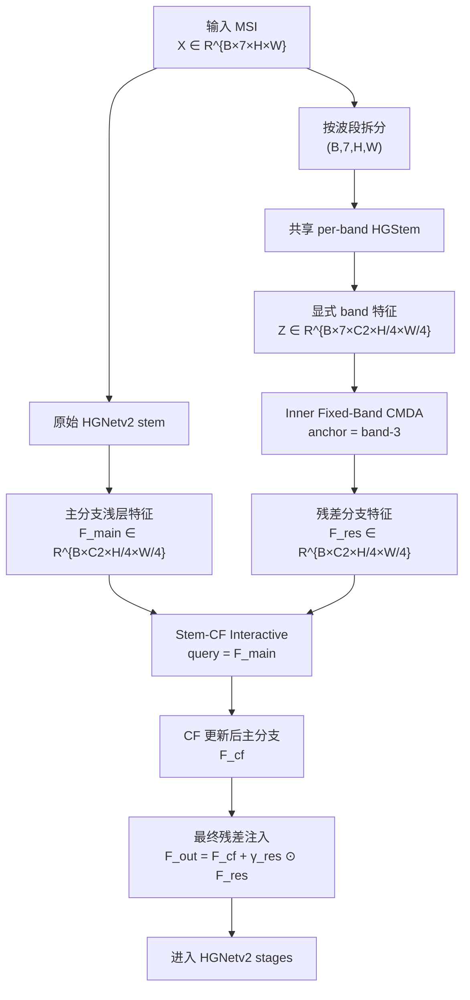
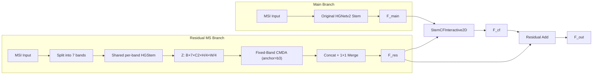
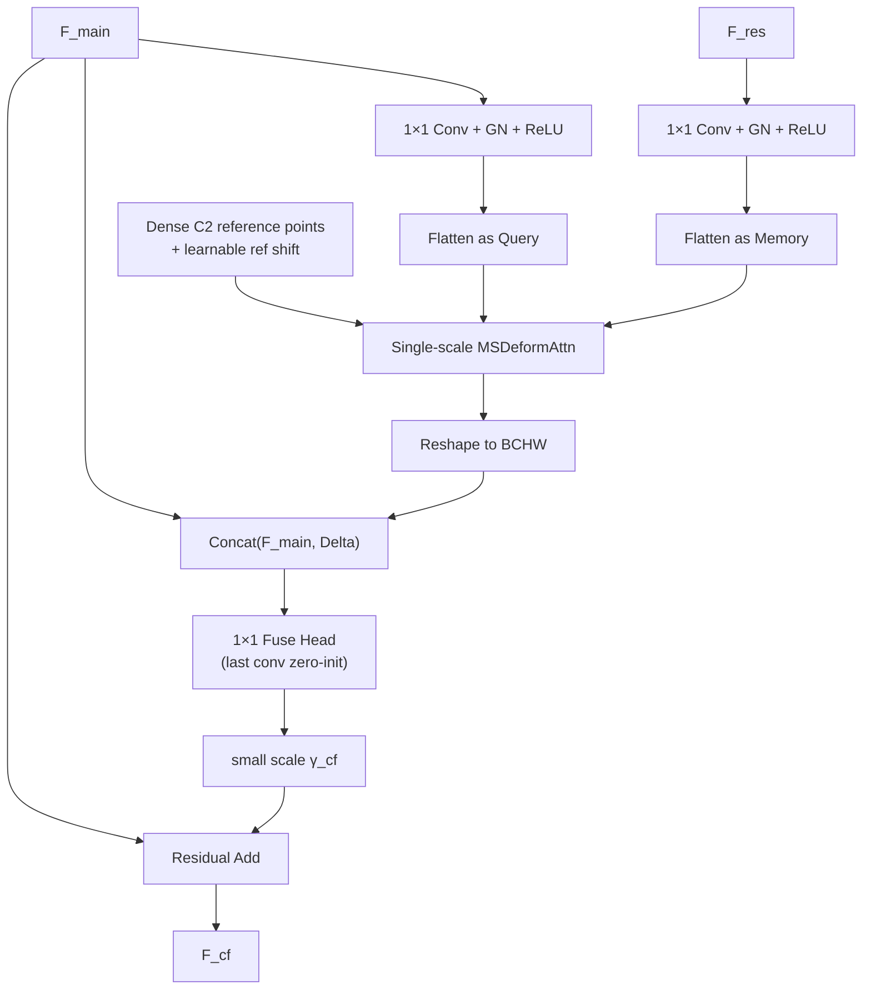

# 设计文档：OrigStem 残差 MS 分支与 Stem-CF 交互模块

本文给出 `origstem_residual_msbranch_shared_hgstem_inner_fixed_band_cmda_b3_stem_cf_interactive` 方法的完整设计说明。该方法面向当前 `smsfdetr` 的 7 通道 MSI-only 检测场景，核心目标是：**在尽量不破坏原始 HGNetv2 stem 稳定性的前提下，显式建模多光谱波段间的浅层错位，并把这种显式 band-wise 几何信息以“保守残差”的形式注入原始主干。**

对应实现：

- 配置文件：`configs/model/smsfdetr/modules/origstem_residual_msbranch_shared_hgstem_inner_fixed_band_cmda_b3_stem_cf_interactive.yaml`
- 主干接入：`engines/models/rtmsfdetr/rtdetrv4/engine/backbone/hgnetv2.py`
- 残差 MS 分支：`engines/models/rtmsfdetr/rtdetrv4/engine/backbone/ms_band_sep.py`
- 固定锚点 CMDA：`engines/models/rtmsfdetr/rtdetrv4/engine/backbone/fixed_band_cmda.py`
- Stem 交互模块：`engines/models/rtmsfdetr/rtdetrv4/engine/backbone/stem_cf_interactive.py`

---

## 1. 动机

### 1.1 为什么不直接改原始 stem

前面的实验已经反复说明一个现象：**原始 HGNetv2 stem 对当前数据是相对稳定的。**

当直接替换或大幅改写 stem 时，容易出现：

1. 浅层纹理统计被破坏；
2. 预训练权重的迁移优势下降；
3. 检测主任务对早期特征的依赖被打乱；
4. 最终表现为训练不稳或测试退化。

因此，本方法不再尝试“重写主干 stem”，而是保留：

\[
\mathbf{F}_{main} = S_{orig}(\mathbf{X})
\]

其中：

- \(\mathbf{X}\in \mathbb{R}^{B\times 7\times H\times W}\) 为 7 波段 MSI 输入；
- \(S_{orig}\) 为原始 HGNetv2 stem；
- \(\mathbf{F}_{main}\in \mathbb{R}^{B\times C_2\times H_2\times W_2}\) 为主分支浅层输出；
- 对当前配置，\(H_2=\frac{H}{4}, W_2=\frac{W}{4}\)。

### 1.2 为什么还需要显式多波段分支

虽然原始 stem 稳定，但它的问题也很明显：**一旦经过普通卷积和后续通道混合，显式 band 维就消失了。**

这意味着：

- 波段间几何错位没有被显式建模；
- 主分支得到的是“混合后”的表征；
- 若波段间存在系统性小偏移，主干只能被动吸收这种误差。

因此，本方法额外构建一个**浅层残差 MS 分支**：

1. 保留显式 band 维；
2. 对 7 个波段分别提浅层特征；
3. 在 band 维仍显式存在时做固定锚点对齐；
4. 只把对检测有帮助的补充信息，以残差方式注入主干。

### 1.3 为什么不是直接用残差分支替代主分支

单独的残差 MS 分支即便引入了 `fixed-band CMDA`，它的收益仍可能不稳定。原因在于：

- 它能显式建模几何，但不一定具备原始 stem 那么强的通用浅层编码能力；
- 它更像一个“纠偏器”，而不是完整替代主干的主表征提取器。

因此，本方法采用“两步注入”：

1. 先用 **CF-style 单尺度 deformable cross interaction**，让主分支特征以残差分支作为 support 做一次保守更新；
2. 再做一次显式 residual add。

这样做的本质是：

> **让原始 stem 继续做主路径，让显式 band-wise 分支负责提供几何补充，而不是抢主干。**

---

## 2. 总体思路

本方法可以概括为四步：

1. **原始主分支**  
   原始 7 通道输入直接进入 HGNetv2 原始 stem，得到主分支浅层特征 \(\mathbf{F}_{main}\)。

2. **残差 MS 分支**  
   将输入拆成 7 个单波段，使用共享的浅层 `HGStem` 提取每个 band 的特征，得到显式 band 特征张量。

3. **分支内部固定锚点 CMDA**  
   以固定 band-3 作为锚点，其余 6 个波段向该锚点对齐并融合，生成残差特征 \(\mathbf{F}_{res}\)。

4. **Stem-CF 交互 + 残差注入**  
   以主分支特征作为 query，以残差分支特征作为 memory，做一次单尺度 deformable cross interaction，得到增强后的主分支 \(\mathbf{F}_{cf}\)；随后再执行最终 residual add：

\[
\mathbf{F}_{out} = \mathbf{F}_{cf} + \boldsymbol{\gamma}_{res}\odot \mathbf{F}_{res}
\]

其中 \(\boldsymbol{\gamma}_{res}\) 为可学习逐通道缩放系数。

---

## 3. 整体流程图

---

## 4. 数学定义

### 4.1 输入与符号

设：

- batch size 为 \(B\)；
- 波段数为 \(N=7\)；
- 主干浅层通道数为 \(C_2\)；
- 浅层特征分辨率为 \(H_2\times W_2\)。

输入记为：

\[
\mathbf{X}\in \mathbb{R}^{B\times N\times H\times W}
\]

输出为：

\[
\mathbf{F}_{out}\in \mathbb{R}^{B\times C_2\times H_2\times W_2}
\]

其中 \(H_2=\frac{H}{4}, W_2=\frac{W}{4}\)。

### 4.2 主分支

原始 HGNetv2 stem 保持不变：

\[
\mathbf{F}_{main}=S_{orig}(\mathbf{X})
\]

这里的关键点不是让主分支显式建模 band 错位，而是让它保留原始 backbone 已验证较稳定的浅层编码能力。

### 4.3 残差 MS 分支

对每个 band 单独做浅层特征提取。记第 \(i\) 个波段输入为 \(\mathbf{X}_i\in\mathbb{R}^{B\times 1\times H\times W}\)，共享浅层提取器为 \(E(\cdot)\)，则：

\[
\mathbf{Z}_i = E(\mathbf{X}_i), \qquad i=1,\dots,7
\]

每个 \(\mathbf{Z}_i\in \mathbb{R}^{B\times C_2\times H_2\times W_2}\)。

堆叠后得到：

\[
\mathbf{Z} = [\mathbf{Z}_1,\mathbf{Z}_2,\dots,\mathbf{Z}_7]
\in \mathbb{R}^{B\times 7\times C_2\times H_2\times W_2}
\]

这里的 `shared_hgstem` 有两个作用：

1. 结构上尽量贴近原始 HGNetv2 stem 的局部归纳偏置；
2. 参数在 band 间共享，避免参数量线性增长到 7 倍。

### 4.4 固定锚点 CMDA

选定固定锚点 band \(a=3\)。记锚点特征为：

\[
\mathbf{A} = \mathbf{Z}_a
\]

对于任意 support band \(i\neq a\)，预测其相对锚点的可变形采样参数。设每个位置取 \(K\) 个采样点，则：

\[
\left\{\Delta_i^k(p)\right\}_{k=1}^{K}, \qquad
\left\{\alpha_i^k(p)\right\}_{k=1}^{K}
\]

其中：

- \(\Delta_i^k(p)\in \mathbb{R}^2\) 为第 \(k\) 个采样偏移；
- \(\alpha_i^k(p)\) 为注意力权重，满足 \(\sum_k \alpha_i^k(p)=1\)。

对 support 特征 \(\mathbf{Z}_i\) 做变形采样：

\[
\hat{\mathbf{Z}}_i(p)
=
\sum_{k=1}^{K}\alpha_i^k(p)\,
\mathbf{Z}_i\big(p+\Delta_i^k(p)\big)
\]

然后用锚点特征对对齐后的 support 做锚点感知融合：

\[
\tilde{\mathbf{Z}}_i
=
\mathcal{F}_{anchor}\big(\mathbf{A}, \hat{\mathbf{Z}}_i\big)
\]

锚点 band 本身保持不变：

\[
\tilde{\mathbf{Z}}_a = \mathbf{A}
\]

最终得到对齐后的 band 特征集合：

\[
\tilde{\mathbf{Z}} = [\tilde{\mathbf{Z}}_1,\dots,\tilde{\mathbf{Z}}_7]
\]

并通过 concat + \(1\times 1\) merge 得到残差分支输出：

\[
\mathbf{F}_{res}
=
M\big(\mathrm{Concat}(\tilde{\mathbf{Z}}_1,\dots,\tilde{\mathbf{Z}}_7)\big)
\]

其中：

\[
\mathbf{F}_{res}\in \mathbb{R}^{B\times C_2\times H_2\times W_2}
\]

### 4.5 Stem-CF Interactive

仅有残差分支还不够，因为主分支 \(\mathbf{F}_{main}\) 和残差分支 \(\mathbf{F}_{res}\) 处在不同的表征空间：

- \(\mathbf{F}_{main}\) 是原始 stem 的混合表征；
- \(\mathbf{F}_{res}\) 是显式 band-wise 建模后的补充表征。

因此，本方法在最终 residual add 之前，先引入一个**单尺度 CF-style deformable cross interaction**：

- query 来自主分支；
- memory 来自残差分支；
- 在同一 C2 网格上做稠密交互。

先对 query 和 memory 进行预投影：

\[
\mathbf{Q} = \phi_q(\mathbf{F}_{main}), \qquad
\mathbf{M} = \phi_m(\mathbf{F}_{res})
\]

其中 \(\phi_q,\phi_m\) 为 \(1\times 1\) Conv + GN + ReLU。

将二维特征展平成序列：

\[
\mathbf{Q}_{flat}\in \mathbb{R}^{B\times (H_2W_2)\times C_2}, \qquad
\mathbf{M}_{flat}\in \mathbb{R}^{B\times (H_2W_2)\times C_2}
\]

对每个栅格点 \(p=(x,y)\) 构建归一化参考点：

\[
\mathbf{r}(p)=
\left(
\frac{x+0.5}{W_2},
\frac{y+0.5}{H_2}
\right)
\]

并加入一个小幅可学习平移：

\[
\mathbf{r}'(p)=\mathrm{clip}\big(\mathbf{r}(p)+\delta_r,\,0,\,1\big)
\]

然后做单尺度 deformable cross-attention：

\[
\mathbf{D}
=
\mathrm{MSDeformAttn}\big(
\mathbf{Q}_{flat},
\mathbf{r}',
\mathbf{M}_{flat}
\big)
\]

将 \(\mathbf{D}\) reshape 回二维特征图后，与主分支拼接做 correction：

\[
\mathbf{C}
=
\psi\big(
\mathrm{Concat}(\mathbf{F}_{main}, \mathrm{reshape}(\mathbf{D}))
\big)
\]

其中 \(\psi\) 为两层 \(1\times 1\) Conv 的小型融合头，最后一层零初始化，使模块初始时近似恒等映射。

于是交互后的主分支为：

\[
\mathbf{F}_{cf}
=
\mathbf{F}_{main}+\boldsymbol{\gamma}_{cf}\odot \mathbf{C}
\]

其中 \(\boldsymbol{\gamma}_{cf}\) 为很小的可学习缩放系数。

### 4.6 最终残差注入

在交互完成后，再执行显式残差注入：

\[
\mathbf{F}_{out}
=
\mathbf{F}_{cf}+\boldsymbol{\gamma}_{res}\odot \mathbf{F}_{res}
\]

其中：

- \(\boldsymbol{\gamma}_{res}\) 是残差分支的逐通道缩放；
- 当前配置使用 `fusion_mode=add`，因此不使用 concat-proj，而是直接 residual add。

---

## 5. 模块图

### 5.1 整体模块图

### 5.2 Stem-CF Interactive 内部结构图

---

## 6. 训练目标

整个模型仍以检测损失为主，记为：

\[
\mathcal{L}_{det}
=
\mathcal{L}_{cls}
+ \lambda_{bbox}\mathcal{L}_{bbox}
+ \lambda_{giou}\mathcal{L}_{giou}
+ \cdots
\]

残差分支内部的 `FixedBandCMDA` 还会引入对齐辅助损失。总损失可写为：

\[
\mathcal{L}
=
\mathcal{L}_{det}
+ \lambda_{align}\mathcal{L}_{align}
+ \lambda_{off}\mathcal{L}_{off}
+ \lambda_{ent}\mathcal{L}_{ent}
\]

其中：

- \(\mathcal{L}_{align}\)：锚点与 support 对齐后的特征一致性损失，当前配置中为 patch InfoNCE；
- \(\mathcal{L}_{off}\)：对偏移幅值的正则；
- \(\mathcal{L}_{ent}\)：对注意力分布熵的约束。

当前配置下：

- `loss_weight = 0.02`
- `loss_offset_weight = 0.01`
- `loss_attn_entropy_weight = 0.001`

而 `StemCFInteractive2D` 自身不额外添加独立监督项，它通过主检测损失端到端学习。

---

## 7. 方法原理总结

该方法的核心原理可以概括为三句话。

### 7.1 主干稳定性优先

原始 stem 已经验证过具有较好的检测稳定性，因此不直接改主干，而是把一切显式几何建模都放在旁路完成。

### 7.2 显式错位建模只在“还能看见 band 维”的地方做

一旦进入普通卷积主干，band 维就被混合掉了。  
因此真正适合做波段错位建模的位置，不是深层混合特征，而是**浅层、显式 band 特征阶段**。`FixedBandCMDA` 正是在这个阶段工作。

### 7.3 用交互修正主分支，而不是让残差分支接管主分支

如果直接把残差分支强行替代主干，会伤害原始主路径的稳定性。  
因此这里先做一次保守的 deformable cross interaction，再做小尺度 residual add：

- 主分支保留主导地位；
- 残差分支只提供“几何补充”；
- 整体更接近 correction，而不是 replacement。

---

## 8. 为什么它比前面几类方案更合理

### 8.1 比直接改 stem 更稳

直接改 stem 会改变主干最敏感的浅层编码器。  
本方法保留原始 stem，不破坏主分支预训练迁移与统计稳定性。

### 8.2 比直接 residual add 更强

如果只有：

\[
\mathbf{F}_{out}=\mathbf{F}_{main}+\boldsymbol{\gamma}_{res}\odot \mathbf{F}_{res}
\]

那么主分支与残差分支之间缺少显式对接过程。  
`StemCFInteractive2D` 的作用，就是先让主分支在自身坐标系里“看一眼”残差分支，再决定如何更新。

### 8.3 比 canonical-reference CRGGA 更直接

这里不再从 7 个 band 里再构造一个新的 canonical reference，而是直接使用固定锚点 band-3。  
这使得残差分支内部的对齐目标更明确，优化问题更简单。

### 8.4 比把 CF-Deformable-DETR 原样照搬更适配当前场景

CF-Deformable-DETR 的核心 CMDA 思想发生在 query-memory 的 cross interaction 上。  
本方法并没有生搬它的 decoder 结构，而是提炼其最适合当前问题的一点：

> **让一个稳定的主特征作为 query，让一个显式几何补充分支作为 memory，在固定浅层网格上做保守的 deformable cross interaction。**

这比直接照搬多尺度 decoder 形式更贴合当前 `smsfdetr` 的单流 MSI 浅层建模需求。

---

## 9. 参数与稳定性设计

这版实现故意做得偏保守。

1. `StemCFInteractive2D` 的输出头最后一层零初始化。  
   这样训练初期近似恒等映射，不会立刻破坏主分支。

2. `stem_interactive.scale_init = 0.01`。  
   说明 CF 交互只允许一开始做很小的修正。

3. `backbone_ms_residual_stem.scale_init = 0.05`。  
   说明残差分支最终注入同样是小权重起步。

4. `memory_detach = true`。  
   在交互模块里默认将 residual memory 视为较稳定的 support，减小主支路与旁路耦合过强的风险。

5. `ref_shift_enabled = true` 且幅度很小。  
   它只允许在参考点上做微小平移，避免交互模块退化成无约束的大范围采样。

因此，这个模块的设计哲学不是“强行重写浅层特征”，而是：

> **在原始主干之上，用一个可学习但幅度受控的几何补充分支做微调。**

---

## 10. 论文表述建议

若在论文中描述该方法，推荐用下面这种方式概括：

> 为了在不破坏原始主干浅层编码稳定性的前提下显式建模 MSI 波段间错位，我们提出一种基于原始 stem 主路径与残差多波段分支的浅层交互结构。具体而言，输入首先经过原始 HGNetv2 stem 得到主分支特征；同时，构建一个保留显式 band 维的浅层残差分支，在该分支内部采用固定锚点 CMDA 对齐各波段特征，并聚合为残差表示。随后，以主分支为 query、残差分支为 memory，在 C2 尺度上执行单尺度 deformable cross interaction，对主分支进行保守修正，并通过可学习残差权重完成最终融合。该设计兼顾了原始主干的稳定性与显式几何建模能力。

---

## 11. 一句话总结

`origstem_residual_msbranch_shared_hgstem_inner_fixed_band_cmda_b3_stem_cf_interactive` 的本质不是“再造一个新 stem”，而是：

> **保留原始 stem 做主干主路径，在旁路显式提取并对齐多波段浅层特征，再用一个轻量的 CF-style deformable 交互模块，把这种显式几何补充以小残差的方式注入主干。**
