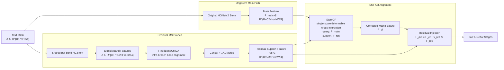
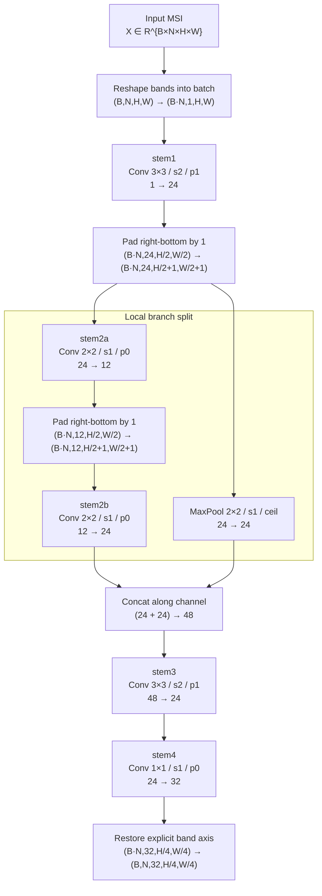
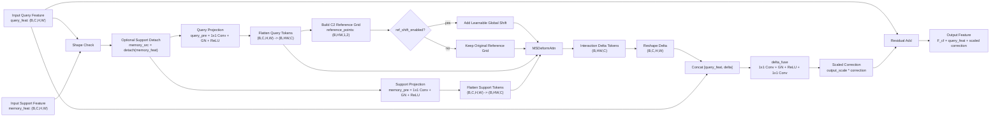
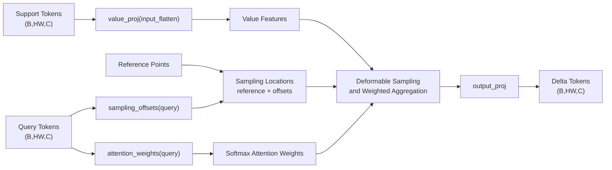

# 论文写法：Shallow Multispectral Feature Align Module（SMFAM）

本节把项目中的
`origstem_residual_msbranch_shared_hgstem_inner_fixed_band_cmda_b3_stem_cf_interactive`
方法，对齐为论文写法，并将其论文名称统一表述为
`Shallow Multispectral Feature Align Module (SMFAM)`。
本文给出其清晰的功能边界、张量符号、公式流程，以及它与
`MS-Stem`/`CRGGA`/直接改写 stem 的区别。

> 命名约定：本文中用
> - `SMFAM` 指 `Shallow Multispectral Feature Align Module`；
> - `OrigStem Main Path` 指原始 HGNetv2 stem 主路径；
> - `Residual MS Branch` 指旁路的显式 band-wise 残差多光谱分支；
> - `FixedBandCMDA` 指锚点感知的单尺度可变形特征对齐与融合模块；
> - `StemCF` 指 `StemCFInteractive2D`，即 C2/stem 尺度的单尺度 deformable cross interaction。

对应实现：

- 配置入口：`configs/task/smsfdetr/oil_msi_20260202_3cls/smsfdetr_oil_msi_20260202_det_rtv4_hgnetv2_m_origstem_residual_msbranch_shared_hgstem_inner_fixed_band_cmda_b3_stem_cf_interactive.yaml`
- 模块配置：`configs/model/smsfdetr/modules/origstem_residual_msbranch_shared_hgstem_inner_fixed_band_cmda_b3_stem_cf_interactive.yaml`
- 主干接入：`engines/models/rtmsfdetr/rtdetrv4/engine/backbone/hgnetv2.py`
- 残差 MS 分支：`engines/models/rtmsfdetr/rtdetrv4/engine/backbone/ms_band_sep.py`
- 固定锚点对齐：`engines/models/rtmsfdetr/rtdetrv4/engine/backbone/fixed_band_cmda.py`
- Stem 交互模块：`engines/models/rtmsfdetr/rtdetrv4/engine/backbone/stem_cf_interactive.py`

### 对应代码定位（截至当前仓库版本）

- 任务配置入口：`configs/task/smsfdetr/oil_msi_20260202_3cls/smsfdetr_oil_msi_20260202_det_rtv4_hgnetv2_m_origstem_residual_msbranch_shared_hgstem_inner_fixed_band_cmda_b3_stem_cf_interactive.yaml:1-40`
- 模块配置：`configs/model/smsfdetr/modules/origstem_residual_msbranch_shared_hgstem_inner_fixed_band_cmda_b3_stem_cf_interactive.yaml:1-49`
- 原始 HGNetV2 `StemBlock` 定义：`engines/models/rtmsfdetr/rtdetrv4/engine/backbone/hgnetv2.py:188-239`
- SMFAM 在 backbone 中的构造与注册：`engines/models/rtmsfdetr/rtdetrv4/engine/backbone/hgnetv2.py:582-753`
- SMFAM 在 backbone `forward` 中的执行路径：`engines/models/rtmsfdetr/rtdetrv4/engine/backbone/hgnetv2.py:1306-1345`
- 逐波段轻量编码器 `_SharedPerBandEmbedding`：`engines/models/rtmsfdetr/rtdetrv4/engine/backbone/ms_band_sep.py:59-100`
- 共享参数逐波段 HGStem `_SharedPerBandHGStem`：`engines/models/rtmsfdetr/rtdetrv4/engine/backbone/ms_band_sep.py:139-187`
- 残差分支主类 `MSBandSeparatedStemAlign`：`engines/models/rtmsfdetr/rtdetrv4/engine/backbone/ms_band_sep.py:190-410`
- `FixedBandCMDA` 在残差分支中的挂载位置：`engines/models/rtmsfdetr/rtdetrv4/engine/backbone/ms_band_sep.py:327-360`
- 残差分支的 `1x1` merge：`engines/models/rtmsfdetr/rtdetrv4/engine/backbone/ms_band_sep.py:380-407`
- 锚点感知融合 `_AnchorAwareFusion`：`engines/models/rtmsfdetr/rtdetrv4/engine/backbone/fixed_band_cmda.py:25-68`
- 固定锚点对齐主类 `FixedBandCMDA`：`engines/models/rtmsfdetr/rtdetrv4/engine/backbone/fixed_band_cmda.py:71-280`
- 锚点索引解析 `_resolve_anchor_index`：`engines/models/rtmsfdetr/rtdetrv4/engine/backbone/fixed_band_cmda.py:183-191`
- `StemCFInteractive2D` 定义：`engines/models/rtmsfdetr/rtdetrv4/engine/backbone/stem_cf_interactive.py:25-190`
- 参考点构造 `_build_reference_points`：`engines/models/rtmsfdetr/rtdetrv4/engine/backbone/stem_cf_interactive.py:125-142`
- `StemCF` 前向交互逻辑：`engines/models/rtmsfdetr/rtdetrv4/engine/backbone/stem_cf_interactive.py:144-190`

---

## 0. 基准配置与命名约定（本文写法对应）

本文默认以当前 MSI-only 单流配置为准：

- task config：
  `configs/task/smsfdetr/oil_msi_20260202_3cls/smsfdetr_oil_msi_20260202_det_rtv4_hgnetv2_m_origstem_residual_msbranch_shared_hgstem_inner_fixed_band_cmda_b3_stem_cf_interactive.yaml`
- backbone base：
  `configs/model/rtmsfdetr/rtv4_hgnetv2_m.yaml`
- module config：
  `configs/model/smsfdetr/modules/origstem_residual_msbranch_shared_hgstem_inner_fixed_band_cmda_b3_stem_cf_interactive.yaml`

关键开关如下：

- `model.dual_stream_backbone=false`：当前是 MSI-only 单流检测，不是 RGB/MS 双流。
- `model.backbone_ms_band_sep.enabled=false`：不使用“完全替换原 stem”的 `MSBandSeparatedStemAlign` 方案。
- `model.backbone_ms_residual_stem.enabled=true`：启用 OrigStem 残差 MS 分支。
- `extractor_type=shared_hgstem`：残差分支内部，每个波段都走一套“共享参数的 HGNetv2-style stem”。
- `stem_norm_type=gn`：显式 band 分支使用 GroupNorm，避免 `(B,N)->(BN)` reshape 后的 BN 统计混合。
- `align.enabled=true` 且 `type=fixed_band_cmda`：在残差分支内部、band 维仍显式存在时做固定锚点对齐。
- `anchor_band_index=3`：按代码语义这是 Python 下标 `3`，即第 `4` 个波段；若论文按 1-based 记法，应写为“第 4 波段为锚点”。
- `anchor_detach=true`，`num_iters=1`
- `num_keypoints=9`，`offset_enabled=true`，`offset_scale=3.0`
- `attention_norm=softmax`，`padding_mode=border`，`align_corners=true`
- `loss_type=infonce`，`loss_weight=0.02`，`loss_offset_weight=0.01`，`loss_attn_entropy_weight=0.001`
- `merge_activation=identity`：残差分支在 merge 到 C2 后不额外做 ReLU，便于表达正负残差修正。
- `stem_interactive.enabled=true`：在最终 residual add 前，先做一次 StemCF 交互。
- `stem_interactive.num_heads=4`，`num_points=4`
- `memory_detach=true`：StemCF 将残差分支当作相对稳定的 support memory。
- `ref_shift_enabled=true`，`ref_shift_scale=0.02`
- `stem_interactive.scale_init=0.01`：StemCF 输出修正从极小幅度起步。
- `fusion_mode=add`，`scale_init=0.05`，`scale_per_channel=true`：最终采用逐通道、小权重的残差注入。
- `post_align.enabled=false`：不再额外做“residual 对主分支”的后对齐，避免模块过重。

训练配置里还有一个和该模块直接相关的点：

- `train.optimizer_param_groups` 为
  `backbone.(ms_residual_stem_branch|ms_residual_scale|ms_residual_stem_interactive)`
  单独设置了更高学习率 `5e-4`，而其余 backbone 非 norm 参数为 `2e-4`。这表明配置层面对新增几何补充分支采取了“新模块快适配、原主干慢微调”的策略。

### 0.1 为什么命名为 SMFAM，而不是 Correction/Interaction Module

论文名称统一采用：

\[
\text{Shallow Multispectral Feature Align Module (SMFAM)}.
\]

这样命名的原因是：

1. **`Align` 更贴合该模块的主线功能。**  
   当前方法首先在残差 MS 分支内部通过 `FixedBandCMDA` 完成显式 band-wise 对齐，再借助 `StemCF` 将对齐后的浅层补充信息读取回主路径。因此，模块的核心是围绕“浅层特征对齐”展开，而不仅是末端的残差修正。

2. **不是纯 Correction Module。**  
   如果直接命名为 `Correction Module`，读者更容易把重点放在“输出被修正了多少”这一结果层面，而忽略该方法最关键的结构设计其实是“在浅层显式保留 band 维，并对其进行几何对齐”。当前方法并不追求对原始图像做传统意义上的辐射校正或全局配准，而是在特征空间内完成受约束的局部对齐与补充。

3. **不是纯 Interaction Module。**  
   `interaction` 只准确描述了 `StemCF` 这一个子步骤，即主 stem 特征作为 query、残差分支特征作为 memory 的 cross-attention 读取过程。它不能覆盖残差分支内部的显式 band-wise 对齐，也不能概括最终的小尺度 residual injection。

4. **`Feature Align` 能更准确限定工作层级。**  
   当前方法作用在 C2/stem 尺度的浅层特征图上，而不是原始图像空间。这里的 `align` 指的是浅层特征域中的局部空间对齐与一致性增强，而不是对原始多光谱图像进行严格的全局精确配准。

简言之，`SMFAM` 的命名强调的是：

> 它是一个作用在浅层多光谱特征上的保守对齐模块，其中残差支路内部的显式 band-wise 对齐是核心，StemCF 交互与 residual injection 则用于将对齐后的补充信息稳定地传回主路径。

---

## 1. 背景：为什么要保留原 stem，再外挂一条显式 MS 残差支路

### 1.1 当前问题不是“主干完全失效”，而是“原 stem 太早把 band 维混掉了”

对 7 通道 MSI 输入，原始 HGNetv2 stem 直接把输入当作普通多通道图像处理：

\[
\mathbf{X}^{ms}\in\mathbb{R}^{B\times 7\times H\times W}
\xrightarrow{S_{orig}}
\mathbf{F}_{main}\in\mathbb{R}^{B\times C_2\times H_2\times W_2}.
\]

这种做法的优点是稳定，缺点是：

- band 维在第一层卷积后就不再显式存在；
- 波段间几何错位被“卷积混合”吞掉；
- 主干只能隐式吸收错位误差，而不是显式建模错位。

### 1.2 直接重写 stem 风险太大

前面的实验已经说明，原始 HGNetv2 stem 对当前数据集具有较好的浅层编码稳定性。若直接改写主 stem，通常会同时引入：

1. 浅层纹理统计变化；
2. 与预训练归纳偏置的不一致；
3. 检测主任务早期特征分布的剧烈漂移。

因此，这里不采用“替换主 stem”的方案，而是保留：

\[
\mathbf{F}_{main}=S_{orig}(\mathbf{X}^{ms})
\]

作为主路径。

### 1.3 需要的不是“另一个主干”，而是“几何补充支路”

本方法额外引入一条浅层 `Residual MS Branch`，目的不是替代主干，而是：

- 保留显式 band 维；
- 在 band 维还没消失时建模多光谱波段间错位；
- 只把这部分几何补充以保守残差形式注入原始主干。

因此，该模块的设计哲学是：

> 原始 stem 继续负责“主表征”，残差 MS 分支只负责“显式几何纠偏与补充”。

---

## 2. 符号与张量形状

设：

- batch size 为 \(B\)；
- 多光谱波段数为 \(N=7\)；
- 输入分辨率为 \(H\times W\)；
- stem/C2 尺度分辨率为 \(H_2\times W_2=\tfrac{H}{4}\times\tfrac{W}{4}\)；
- HGNetv2-M 在当前配置下对应 `HGNetv2.name='B2'`，其 stage-1 输入通道数为 \(C_2=32\)。

输入：

\[
\mathbf{X}^{ms}\in\mathbb{R}^{B\times N\times H\times W}.
\]

原始主路径输出：

\[
\mathbf{F}_{main}\in\mathbb{R}^{B\times C_2\times H_2\times W_2}.
\]

残差分支的显式波段特征：

\[
\mathbf{Z}\in\mathbb{R}^{B\times N\times C_2\times H_2\times W_2}.
\]

经固定锚点 CMDA 后的波段特征：

\[
\widetilde{\mathbf{Z}}\in\mathbb{R}^{B\times N\times C_2\times H_2\times W_2}.
\]

merge 后的残差分支输出：

\[
\mathbf{F}_{res}\in\mathbb{R}^{B\times C_2\times H_2\times W_2}.
\]

StemCF 交互后的主分支：

\[
\mathbf{F}_{cf}\in\mathbb{R}^{B\times C_2\times H_2\times W_2}.
\]

最终输出：

\[
\mathbf{F}_{out}\in\mathbb{R}^{B\times C_2\times H_2\times W_2}.
\]

---

## 3. 整体流程

整个模块可以概括为五步：

1. 原始 MSI 输入直接走原始 HGNetv2 stem，得到主分支特征 \(\mathbf{F}_{main}\)；
2. 同一输入并行进入残差 MS 分支，逐波段提取共享浅层特征，得到 \(\mathbf{Z}\)；
3. 在 \(\mathbf{Z}\) 上以固定锚点波段做 `FixedBandCMDA`，得到 \(\widetilde{\mathbf{Z}}\)；
4. 将 \(\widetilde{\mathbf{Z}}\) merge 成 \(\mathbf{F}_{res}\)，再用 `StemCF` 对主分支做一次保守的 query-memory 交互，得到 \(\mathbf{F}_{cf}\)；
5. 最后做小尺度逐通道 residual add，得到 \(\mathbf{F}_{out}\)，再送入后续 HGNetv2 stages。

对应公式写为：

\[
\mathbf{F}_{main}=S_{orig}(\mathbf{X}^{ms}),
\]

\[
\mathbf{F}_{res}=M\big(\mathrm{FixedBandCMDA}(E(\mathbf{X}^{ms}))\big),
\]

\[
\mathbf{F}_{cf}=\mathrm{StemCF}(\mathbf{F}_{main},\mathbf{F}_{res}),
\]

\[
\mathbf{F}_{out}=\mathbf{F}_{cf}+\boldsymbol{\gamma}_{res}\odot\mathbf{F}_{res}.
\]

其中：

- \(E(\cdot)\) 是共享参数的逐波段 HGStem；
- \(M(\cdot)\) 是 concat + \(1\times 1\) merge；
- \(\boldsymbol{\gamma}_{res}\) 是可学习逐通道残差缩放参数。

### 3.1 SMFAM 模块流程图

---

## 4. 原始主路径：保留 HGNetv2 stem 作为稳定的主表征提取器

原始主路径不改结构，直接使用 `hgnetv2.py` 中的 `StemBlock`：

代码定位：`StemBlock` 定义位于 `engines/models/rtmsfdetr/rtdetrv4/engine/backbone/hgnetv2.py:188-239`；在当前 SMFAM 配置下，主路径先执行原始 `self.stem(stem_input)`，再与残差支路汇合的逻辑位于 `engines/models/rtmsfdetr/rtdetrv4/engine/backbone/hgnetv2.py:1328-1345`。

\[
\mathbf{F}_{main}=S_{orig}(\mathbf{X}^{ms}).
\]

它的作用不是显式对齐波段，而是保留原始 backbone 的两点优势：

1. 对检测任务已经验证过的浅层归纳偏置；
2. 与后续 stage-1 输入通道数 \(C_2\) 的天然兼容。

需要强调的是，在这条主路径上：

- 7 个波段从输入开始就被普通卷积混合；
- 几何错位不会被显式表示为“band-to-band 关系”；
- 因此它适合作为稳定主干，但不适合单独承担精细波段对齐任务。

这正是额外挂残差 MS 分支的原因。

---

## 5. 残差 MS 分支：在显式 band 维上提取并对齐几何补充

### 5.1 共享 HGStem 的逐波段特征提取

残差 MS 分支调用的是 `MSBandSeparatedStemAlign`，但这里不是用它来“替换原 stem”，而是把它当作一条旁路。配置里：

代码定位：残差分支主类位于 `engines/models/rtmsfdetr/rtdetrv4/engine/backbone/ms_band_sep.py:190-410`；其中共享逐波段 HGStem `_SharedPerBandHGStem` 位于 `engines/models/rtmsfdetr/rtdetrv4/engine/backbone/ms_band_sep.py:139-187`，残差分支在 backbone 中的实例化位于 `engines/models/rtmsfdetr/rtdetrv4/engine/backbone/hgnetv2.py:626-637`。

- `extractor_type=shared_hgstem`
- `stem_norm_type=gn`

意味着对每个波段都使用同一套 HGNetv2-style stem 拓扑，且参数共享。

把输入沿 band 维展开：

\[
\overline{\mathbf{X}}=\mathrm{reshape}(\mathbf{X}^{ms})\in\mathbb{R}^{(BN)\times 1\times H\times W}.
\]

令共享逐波段提取器为 \(E_{hg}(\cdot)\)，则：

\[
\overline{\mathbf{Z}}=E_{hg}(\overline{\mathbf{X}})
\in\mathbb{R}^{(BN)\times C_2\times H_2\times W_2}.
\]

再 reshape 回显式波段维：

\[
\mathbf{Z}=\mathrm{reshape}^{-1}(\overline{\mathbf{Z}})
\in\mathbb{R}^{B\times N\times C_2\times H_2\times W_2}.
\]

这里的关键点是：

- 结构上尽量沿用原 HGNetv2 stem 的局部卷积归纳偏置；
- 参数在 7 个 band 间共享，不引入 7 倍参数量；
- 在对齐前始终保留显式 band 维，不发生跨 band 卷积混合。

#### 5.1.1 `_SharedPerBandHGStem` 结构图

从代码实现上看，`_SharedPerBandHGStem` 基本复用了原始 `StemBlock` 的拓扑，只是把输入改成“逐 band 独立处理 + 参数共享”的形式。其前向流程对应 `engines/models/rtmsfdetr/rtdetrv4/engine/backbone/ms_band_sep.py:172-187`。在当前 HGNetv2-M(B2) 配置下，残差支路默认取 `mid_channels=24`、`out_channels=32`，因此该模块的具体结构可画为：

图中两个分支分别对应代码中的：

- `y2 = stem2a(y) -> pad -> stem2b(y2)`，即局部卷积分支；
- `y1 = pool(y)`，即池化分支；
- 随后通过 `torch.cat([y1, y2], dim=1)` 完成通道拼接，再经 `stem3` 和 `stem4` 输出逐波段浅层特征。

若用更形式化的方式表述，其映射关系可写为：

\[
\mathbf{U}_1=\mathrm{Conv}_{3\times3,s=2}(\mathbf{X}_{flat}),
\]

\[
\mathbf{U}_{2a}=\mathrm{Conv}_{2\times2}\big(\mathrm{Pad}(\mathbf{U}_1)\big),
\qquad
\mathbf{U}_{2b}=\mathrm{Conv}_{2\times2}\big(\mathrm{Pad}(\mathbf{U}_{2a})\big),
\]

\[
\mathbf{U}_{pool}=\mathrm{MaxPool}_{2\times2,s=1}\big(\mathrm{Pad}(\mathbf{U}_1)\big),
\]

\[
\mathbf{U}_{cat}=\mathrm{Concat}\big(\mathbf{U}_{pool},\mathbf{U}_{2b}\big),
\]

\[
\mathbf{Z}_{flat}=\mathrm{Conv}_{1\times1}\!\left(\mathrm{Conv}_{3\times3,s=2}(\mathbf{U}_{cat})\right),
\]

\[
\mathbf{Z}=\mathrm{reshape}^{-1}(\mathbf{Z}_{flat})\in\mathbb{R}^{B\times N\times C_2\times H_2\times W_2}.
\]

这里 \(\mathbf{X}_{flat}\in\mathbb{R}^{(BN)\times1\times H\times W}\)，而在当前配置下 \(C_2=32\)。因此，`_SharedPerBandHGStem` 的本质可以理解为：先对每个波段独立施加一个与原始 HGNetV2 stem 近似同构的浅层卷积编码器，再把输出重新整理回显式 band 维表示，供后续 `FixedBandCMDA` 使用。

### 5.2 为什么使用 GroupNorm 而不是 BatchNorm

实现中每个 band 实际是通过
\((B,N,H,W)\rightarrow(BN,1,H,W)\)
的方式送入共享 stem。

若使用 BN，则统计量会在：

- 不同样本之间；
- 不同波段之间

共同混合，这不符合“逐 band 独立编码”的意图。

因此配置里显式指定 `stem_norm_type=gn`，使归一化保持 per-sample，更稳定。

---

## 6. 分支内部的 FixedBandCMDA：显式 band-wise 特征的可变形对齐

### 6.1 动机：不用 canonical reference，而是直接选定一个真实波段做坐标系

代码定位：`FixedBandCMDA` 的定义位于 `engines/models/rtmsfdetr/rtdetrv4/engine/backbone/fixed_band_cmda.py:71-280`，其在残差分支中的挂载位置位于 `engines/models/rtmsfdetr/rtdetrv4/engine/backbone/ms_band_sep.py:327-360`；锚点索引解析逻辑位于 `engines/models/rtmsfdetr/rtdetrv4/engine/backbone/fixed_band_cmda.py:183-191`。

与 `CRGGA` 不同，这里不再从全部波段构造动态 canonical reference，而是直接选定一个固定锚点波段：

\[
a=3.
\]

注意这里的 \(a=3\) 是代码中的 0-based 索引，因此对应第 `4` 个波段。

锚点特征记为：

\[
\mathbf{A}=\mathbf{Z}_a\in\mathbb{R}^{B\times C_2\times H_2\times W_2}.
\]

这样做的优点是：

1. 对齐目标明确，所有 support band 都朝同一个真实波段坐标系对齐；
2. 避免再学习一个动态 reference，优化问题更简单；
3. 与 MSI-only 单流场景更匹配，因为这里需要的是浅层几何校正，而不是 reference 学习本身。

### 6.2 对每个 support band 做可变形对齐

对任意 support band \(i\neq a\)，记其特征为 \(\mathbf{Z}_i\)。

配置中：

- `num_keypoints=9`
- `offset_enabled=true`
- `attention_norm=softmax`
- `offset_scale=3.0`
- `anchor_detach=true`

因此，实际做的是一个单尺度、共享 warp 的可变形对齐器。设每个位置 \(p\) 预测 \(K=9\) 个采样点，则：

\[
\left\{\Delta_i^k(p)\right\}_{k=1}^{K},\qquad
\left\{\alpha_i^k(p)\right\}_{k=1}^{K},
\quad \sum_{k=1}^{K}\alpha_i^k(p)=1.
\]

用双线性采样从 support band 取值：

\[
\mathbf{S}_i^k(p)=\mathbf{Z}_i\big(p+\Delta_i^k(p)\big).
\]

再做注意力加权得到对齐后的 support 特征：

\[
\widehat{\mathbf{Z}}_i(p)=\sum_{k=1}^{K}\alpha_i^k(p)\mathbf{S}_i^k(p).
\]

其中 `anchor_detach=true` 表示，在预测 offset/attention 时，锚点特征 \(\mathbf{A}\) 的梯度默认截断。论文里可以记作：

\[
\mathbf{A}_{pred}=\mathrm{stopgrad}(\mathbf{A}).
\]

这会让锚点更像“稳定参照系”，减少锚点与 support 同时漂移带来的不稳定。

### 6.3 对齐后不是直接输出，而是做锚点感知融合

`FixedBandCMDA` 的关键不是只有 warp，它还包含一个锚点感知融合块 `_AnchorAwareFusion`。即：

代码定位：`_AnchorAwareFusion` 定义位于 `engines/models/rtmsfdetr/rtdetrv4/engine/backbone/fixed_band_cmda.py:25-68`；在 `FixedBandCMDA.forward(...)` 中对 support band 先对齐再执行 `self.fuse(anchor, aligned)` 的流程位于 `engines/models/rtmsfdetr/rtdetrv4/engine/backbone/fixed_band_cmda.py:221-244`。

\[
\widetilde{\mathbf{Z}}_i=\mathcal{F}_{anchor}(\mathbf{A},\widehat{\mathbf{Z}}_i).
\]

其实现可以概括为：

\[
\mathbf{Q}_a=\phi_a(\mathbf{A}),
\]

\[
\mathbf{G}_i=\sigma\big(g([\mathbf{Q}_a;\widehat{\mathbf{Z}}_i])\big),
\]

\[
\Delta_i=\psi\big([\widehat{\mathbf{Z}}_i;\mathbf{Q}_a\odot\mathbf{G}_i]\big),
\]

\[
\widetilde{\mathbf{Z}}_i=\widehat{\mathbf{Z}}_i+\Delta_i.
\]

这里：

- \(\phi_a(\cdot)\) 是锚点投影；
- \(g(\cdot)\) 生成 gate；
- \(\psi(\cdot)\) 是轻量的 \(1\times 1\) 融合头；
- 最后一层是零初始化，因此初始时
  \(\widetilde{\mathbf{Z}}_i\approx\widehat{\mathbf{Z}}_i\)，训练更稳定。

也就是说，这里做的不是“纯配准”，而是：

> 先把 support 对齐到锚点坐标系，再在锚点条件下对 support 做一次轻量融合修正。

因此，`FixedBandCMDA` 在整个 SMFAM 中承担的是：

1. **残差支路内部的显式波段错位修正器。**
2. **从显式 band 特征到“可被主路径利用的几何补充特征”的生成器。**
3. **整个方法中唯一明确对应“alignment”语义的子模块。**

换句话说，`FixedBandCMDA` 的作用不是定义整个方法，而是负责 SMFAM 里的“对齐子过程”。

### 6.4 锚点 band 本身保持显式存在

对于锚点 band \(a\)，输出直接保留：

\[
\widetilde{\mathbf{Z}}_a=\mathbf{A}.
\]

于是所有波段堆叠后得到：

\[
\widetilde{\mathbf{Z}}\in\mathbb{R}^{B\times N\times C_2\times H_2\times W_2}.
\]

配置中 `num_iters=1`，因此这里只做一轮对齐与融合，不进行多轮迭代 refine。

---

## 7. 残差分支 merge：把显式 band 特征压回主干可接收的 C2 表示

代码定位：残差分支的 `1x1` merge 定义位于 `engines/models/rtmsfdetr/rtdetrv4/engine/backbone/ms_band_sep.py:380-385`，其在 `forward(...)` 中对 `z_flat` 执行通道压缩的逻辑位于 `engines/models/rtmsfdetr/rtdetrv4/engine/backbone/ms_band_sep.py:406-407`。

对齐后的显式 band 特征还不能直接与主分支相加，需要先 merge 回标准 C2 表示。

首先展平 band 维：

\[
\mathbf{Z}_{flat}
=\mathrm{Concat}\big(
\widetilde{\mathbf{Z}}_1,\dots,\widetilde{\mathbf{Z}}_N
\big)
\in\mathbb{R}^{B\times (NC_2)\times H_2\times W_2}.
\]

再用 \(1\times 1\) 卷积压回 \(C_2\) 通道：

\[
\mathbf{F}_{res}=M(\mathbf{Z}_{flat})
\in\mathbb{R}^{B\times C_2\times H_2\times W_2}.
\]

这里的 `merge_activation=identity` 很关键。它意味着 merge 后不加额外 ReLU：

- 残差分支可以表达正、负两种修正方向；
- 更符合“residual correction”而不是“重新做一遍强非线性特征提取”；
- 与后面的 residual add 逻辑一致。

---

## 8. StemCF：在 C2 网格上用残差分支保守修正主分支

代码定位：`StemCFInteractive2D` 定义位于 `engines/models/rtmsfdetr/rtdetrv4/engine/backbone/stem_cf_interactive.py:25-190`；其在 backbone 中的实例化位于 `engines/models/rtmsfdetr/rtdetrv4/engine/backbone/hgnetv2.py:655-696`，在主干前向中的调用位于 `engines/models/rtmsfdetr/rtdetrv4/engine/backbone/hgnetv2.py:1306-1315` 与 `engines/models/rtmsfdetr/rtdetrv4/engine/backbone/hgnetv2.py:1337-1338`。

### 8.1 模块定位

如果只做

\[
\mathbf{F}_{out}=\mathbf{F}_{main}+\boldsymbol{\gamma}_{res}\odot\mathbf{F}_{res},
\]

那么主分支和残差分支之间缺少显式的信息对接过程。

因此，本方法先插入一个 `StemCF`：

- query：原始主分支 \(\mathbf{F}_{main}\)
- support feature：残差分支 \(\mathbf{F}_{res}\)

它不是完整复刻 `CF-Deformable-DETR` 的多尺度 decoder，而是把“用 deformable cross-attention 做支路间交互”的核心思想压缩到了单尺度 C2 网格上。

### 8.2 输入投影与 support detach（配置项对应 `memory_detach`）

为避免把该步骤误解为标准 Transformer 中显式的 \(Q/K/V\) 三分支，这里把残差分支 \(\mathbf{F}_{res}\) 记作 `support feature` 更合适。其含义是：它是供主分支读取的支撑特征源；而 `value` 仅是 `MSDeformAttn` 算子内部对这一路支撑特征做线性投影后的中间变量。先对 query 与 support feature 做预投影：

\[
\mathbf{Q}=\phi_q(\mathbf{F}_{main}),\qquad
\mathbf{S}=\phi_m(\mathbf{F}_{res}^{det}),
\]

其中当 `memory_detach=true` 时：

\[
\mathbf{F}_{res}^{det}=\mathrm{stopgrad}(\mathbf{F}_{res}).
\]

这意味着 StemCF 是一种“主分支读取残差分支信息”的单向修正，而不是让两条支路在这里强耦合互相拉扯。

### 8.3 构造参考点并做单尺度 deformable cross-attention

代码定位：规则参考点网格由 `_build_reference_points(...)` 构造，位于 `engines/models/rtmsfdetr/rtdetrv4/engine/backbone/stem_cf_interactive.py:125-142`；加入全局可学习微偏移并执行 `MSDeformAttn` 的逻辑位于 `engines/models/rtmsfdetr/rtdetrv4/engine/backbone/stem_cf_interactive.py:166-190`。

把二维特征图展平成序列：

\[
\mathbf{Q}_{flat}\in\mathbb{R}^{B\times(H_2W_2)\times C_2},
\qquad
\mathbf{S}_{flat}\in\mathbb{R}^{B\times(H_2W_2)\times C_2}.
\]

对每个格点 \(p=(x,y)\) 构造归一化 reference point：

\[
\mathbf{r}(p)=
\left(
\frac{x+0.5}{W_2},
\frac{y+0.5}{H_2}
\right).
\]

配置中 `ref_shift_enabled=true`，因此会再加入一个全局可学习微小偏移：

\[
\mathbf{r}'(p)=\mathrm{clip}\big(\mathbf{r}(p)+\delta_r,\,0,\,1\big),
\]

其中
\[
\delta_r=s\cdot\tanh(\mathbf{u}),\qquad s=0.02.
\]

在 `MSDeformAttn` 内部，\(\mathbf{Q}_{flat}\) 不会像标准 attention 那样与显式 `K` 做全局点积，而是用来预测采样偏移与注意力权重；\(\mathbf{S}_{flat}\) 则先投影成内部 `value` 表示 \(\mathbf{V}\)。因此更准确的算子级过程是：

\[
\Delta \mathbf{p},\boldsymbol{\alpha}=g(\mathbf{Q}_{flat}),\qquad
\mathbf{V}=W_v\mathbf{S}_{flat}.
\]

然后执行单尺度 `MSDeformAttn`：

\[
\mathbf{D}
=
\mathrm{MSDeformAttn}\big(
\mathbf{Q}_{flat},
\mathbf{r}',
\mathbf{S}_{flat}
\big).
\]

这一步的含义是：

> 让主分支每个 C2 位置，在残差分支上以可变形采样方式读取一小组 support 信息，而不是做刚性的逐像素相加。

### 8.4 StemCF 整体执行流程图

下图严格对应 `StemCFInteractive2D.forward(...)` 的执行顺序，即：输入检查、support detach、双支路预投影、展平、参考点构造、单尺度 `MSDeformAttn` 交互、`delta_fuse` 写回以及最终的保守残差更新。

### 8.5 `MSDeformAttn` 算子内部流程图

下图对应 `engines/models/msifdetr/common/ops/modules/ms_deform_attn.py:99-140`。它说明这一步不是标准的 \(QK^\top V\)，而是由 query 预测采样位置与注意力权重，再到 support/value 特征上执行可变形采样聚合。

### 8.6 用零初始化修正头把交互写回主分支

将 \(\mathbf{D}\) reshape 回二维特征图后，与原始主分支拼接：

\[
\mathbf{C}
=
\psi\big(
[\mathbf{F}_{main};\mathrm{reshape}(\mathbf{D})]
\big).
\]

最终得到交互后的主分支：

\[
\mathbf{F}_{cf}
=
\mathbf{F}_{main}
+\boldsymbol{\gamma}_{cf}\odot\mathbf{C}.
\]

其中：

- `delta_fuse` 的最后一层卷积零初始化；
- `scale_init=0.01`；
- `scale_per_channel=true`。

因此训练初期：

\[
\mathbf{F}_{cf}\approx\mathbf{F}_{main},
\]

StemCF 更像一个极保守的微调器，而不是大幅改写主分支。

从命名角度看，`StemCF` 准确对应的是 `interaction` 语义，因为它做的是：

- 主路径读取残差支路信息；
- 通过 cross-attention 产生 correction；
- 再把 correction 写回主路径。

因此，若单独看 `StemCF`，称其为“浅层交互模块”是成立的；但若把整个方法都命名为 `interaction module`，则会遗漏 `FixedBandCMDA` 这一残差支路内部的显式对齐与校正过程。

---

## 9. 最终融合：交互之后再做小尺度残差注入

代码定位：最终 residual add 发生在 `engines/models/rtmsfdetr/rtdetrv4/engine/backbone/hgnetv2.py:1339-1345`；其中 `fusion_mode=add` 时执行 `x = x + (self.ms_residual_scale * residual)`，若切换为 `concat_proj` 则改为先拼接再投影。

在 StemCF 之后，才执行最终 residual add：

\[
\mathbf{F}_{out}
=
\mathbf{F}_{cf}
+\boldsymbol{\gamma}_{res}\odot\mathbf{F}_{res}.
\]

当前配置中：

- `fusion_mode=add`
- `scale_init=0.05`
- `scale_per_channel=true`

因此 \(\boldsymbol{\gamma}_{res}\) 是一个逐通道、初值很小的可学习缩放系数。

这一步的含义是：

1. StemCF 先让主分支“看一眼”残差几何补充；
2. residual add 再把残差分支本身以小幅度显式注入；
3. 整体保持“主干主导，旁路补充”的结构关系。

这也是为什么论文名称最终采用 `Feature Align`：  
整个模块最核心的结构不是生成“一个单独的交互特征”，而是先在浅层构造显式 band-wise 对齐，再把这部分对齐后的几何补充稳定注入主路径，因此更适合被概括为**面向浅层多光谱特征的一体化对齐模块**。

---

## 10. 训练目标与配置含义

### 10.1 检测损失仍是主目标

整个网络仍然以检测主损失为主，记为：

\[
\mathcal{L}_{det}.
\]

OrigStem 残差 MS 分支并不改变 RT-DETRv4 的主检测框架，它只是提供更适合 MSI 浅层建模的输入特征。

### 10.2 FixedBandCMDA 提供辅助对齐损失

残差分支内部的 `FixedBandCMDA` 在训练时可额外返回辅助损失。当前配置中启用了：

- `loss_type=infonce`
- `loss_weight=0.02`
- `loss_offset_weight=0.01`
- `loss_attn_entropy_weight=0.001`

因此总损失可以写作：

\[
\mathcal{L}
=
\mathcal{L}_{det}
+\lambda_{align}\mathcal{L}_{align}
+\lambda_{off}\mathcal{L}_{off}
+\lambda_{ent}\mathcal{L}_{ent}.
\]

其中：

- \(\mathcal{L}_{align}\) 是锚点与对齐后 support 的 patch InfoNCE 一致性约束；
- \(\mathcal{L}_{off}\) 约束有效位移幅度；
- \(\mathcal{L}_{ent}\) 约束注意力分布熵，避免过度塌缩或过度发散。

StemCF 本身没有单独显式监督项，它通过检测损失端到端学习。

### 10.3 为什么不给主分支再做 post-align

配置里 `post_align.enabled=false`。这说明当前设计明确避免：

- 先对残差分支内部做一轮 band 对齐；
- 再把 merge 后残差特征继续对齐到主分支；
- 再做交互和残差加和。

原因很直接：这会让浅层模块过重、自由度过多，也更容易干扰原始主 stem 的稳定性。当前方案只保留“分支内部对齐 + 主分支交互 + 小残差注入”这一条更保守的路径。

---

## 11. 与相关方案的区别

### 11.1 与 `backbone_ms_band_sep` 的区别

`backbone_ms_band_sep` 是“用显式 band stem 直接替换原始 stem”；而本文方法是：

- 原始 stem 保留；
- `MSBandSeparatedStemAlign` 只作为残差旁路存在；
- 主路径和显式 band 旁路并行工作。

因此它更稳健，也更适合“主干已经基本可靠，只差显式几何补充”的场景。

### 11.2 与 `CRGGA` 的区别

`CRGGA` 的核心是：

- 从全部 band 构造 canonical reference；
- 每个 band 再对该 reference 对齐。

本文方法的核心则是：

- 直接固定一个真实波段做锚点；
- 所有 support band 朝该锚点对齐；
- 对齐后在锚点条件下融合；
- 最终把这条显式几何支路注入原始 stem 主路径。

因此它比 CRGGA 更偏“固定坐标系下的浅层几何补充”，而不是“学习 reference 的 groupwise alignment”。

### 11.3 与“只有 residual add、没有 StemCF”的区别

若没有 StemCF，则主分支与残差分支只在最后一步线性叠加。这样的问题是：

- 主分支没有机会主动选择如何读取残差几何信息；
- 残差分支只能被动加到主分支上。

StemCF 的意义就在于：先让主分支在自身坐标系中，借助可变形 cross-attention 对残差信息做一次受控读取，再做最终残差注入。

---

## 12. 方法原理总结

`origstem_residual_msbranch_shared_hgstem_inner_fixed_band_cmda_b3_stem_cf_interactive`
的本质不是“再造一个新 stem”，而是：

1. 保留原始 HGNetv2 stem 作为稳定主路径；
2. 额外挂一条保留显式 band 维的浅层残差 MS 分支；
3. 在该分支内部用固定锚点波段做显式 band-wise 可变形对齐与锚点感知融合；
4. 将对齐后的残差表示 merge 成标准 C2 特征；
5. 通过一个单尺度、保守的 StemCF 交互先修正主分支，再用小尺度逐通道 residual add 完成最终注入。

如果用一句话概括，它更接近：

> 用“原始 stem 主路径 + 显式 band-wise 几何补充分支”的结构，把 MSI 波段错位信息以低风险方式注入检测 backbone 的最浅层。

若用论文命名总结，则可写为：

> `SMFAM` 是一个面向浅层多光谱特征的保守对齐模块，其中 `FixedBandCMDA` 负责残差支路内部的显式 band-wise 对齐与校正，`StemCF` 负责主路径与残差支路之间的交互式修正，而最终 residual injection 则完成对主路径表示的浅层对齐信息注入。

---

## 13. 论文表述建议

若在论文中描述该模块，推荐写成：

> 为了在不破坏原始主干浅层编码稳定性的前提下显式建模多光谱波段间的浅层错位，我们设计了一种基于原始 stem 主路径与残差多波段分支的浅层交互结构。具体而言，输入首先经过原始 HGNetv2 stem 获得主分支特征；同时，构建一条保留显式 band 维的残差多光谱分支，并在该分支内部采用固定锚点波段的可变形对齐与锚点感知融合，得到几何补充表示。随后，以主分支为 query、以残差分支为 memory，在 C2 尺度上执行单尺度 deformable cross interaction，对主分支进行保守修正，并通过可学习逐通道残差权重完成最终融合。该设计兼顾了原始主干的稳定性与显式波段错位建模能力。
