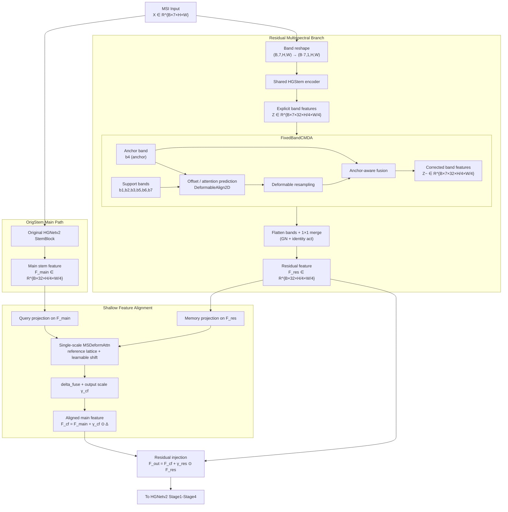
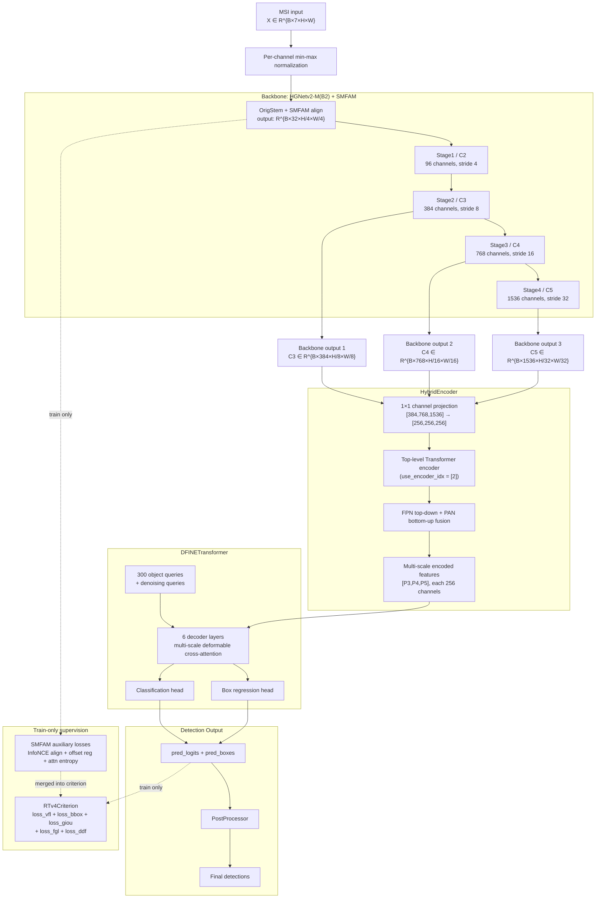

# SMFAM 结构图与整网结构图

本文档给出当前方法对应的两张可编辑 Mermaid 结构图：

1. `SMFAM` 模块细粒度结构图
2. 当前 `MSI-only SMSF-DETR` 整体网络结构图

对应配置：

- `configs/task/smsfdetr/oil_msi_20260202_3cls/smsfdetr_oil_msi_20260202_det_rtv4_hgnetv2_m_origstem_residual_msbranch_shared_hgstem_inner_fixed_band_cmda_b3_stem_cf_interactive.yaml`

对应主干与检测框架：

- Backbone：`HGNetv2-M (B2)` + `SMFAM`
- Encoder：`HybridEncoder`
- Decoder：`DFINETransformer`

---

## 1. SMFAM 模块细粒度结构图

建议论文图题：

- 图 X SMFAM 模块结构图

### 1.1 图示说明

- 主路径保留原始 `HGNetv2 StemBlock`，提供稳定的浅层主特征 `F_main`。
- 残差支路保留显式 band 维，在 `FixedBandCMDA` 中完成“固定锚点波段引导的波段校正”。
- `FixedBandCMDA` 的核心是“对齐 + 锚点条件融合”，不是单纯的 deformable warping。
- `StemCF` 负责跨支路浅层交互修正：主路径作为 query，残差支路作为 memory。
- 最终通过小权重残差注入得到 `F_out`，再送入后续 `HGNetv2` stage。

---

## 2. 当前整网结构图

建议论文图题：

- 图 Y 基于 SMFAM 的 MSI-only SMSF-DETR 整体网络结构图

### 2.1 图示说明

- 当前方法不是双流 RGB+MS，而是单流 `MSI-only` 配置。
- `SMFAM` 只作用在 backbone 最浅层，即 `Stem/C2` 附近。
- `HGNetv2-M(B2)` 主干在当前配置下输出三个尺度给检测头：
  - `C3`: `384` channels, stride `8`
  - `C4`: `768` channels, stride `16`
  - `C5`: `1536` channels, stride `32`
- `HybridEncoder` 将三层主干特征统一投影到 `256` 维，并通过 top-level encoder + FPN/PAN 生成 `[P3,P4,P5]`。
- `DFINETransformer` 基于多尺度特征和查询向量输出分类与边界框预测。
- 训练时，`SMFAM` 内部的辅助对齐损失会作为额外项并入 `RTv4Criterion`。

---

## 3. 使用建议

- 如果你后续要把它们放进论文，建议先在 Mermaid Live Editor 中微调节点位置，再导出为 `svg`。
- 这两张图当前是“结构准确优先”的版本，适合继续人工美化成论文终稿。
- 如果你需要，我下一步可以继续帮你做两个版本：
  - 论文简洁版：节点更少，更适合正文插图
  - 答辩详细版：保留通道数、stride 和内部子模块
